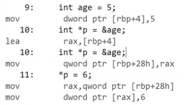
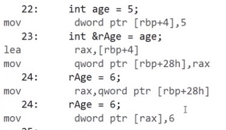
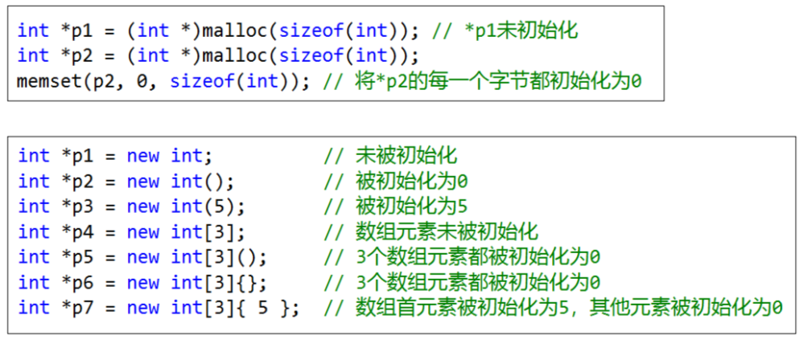
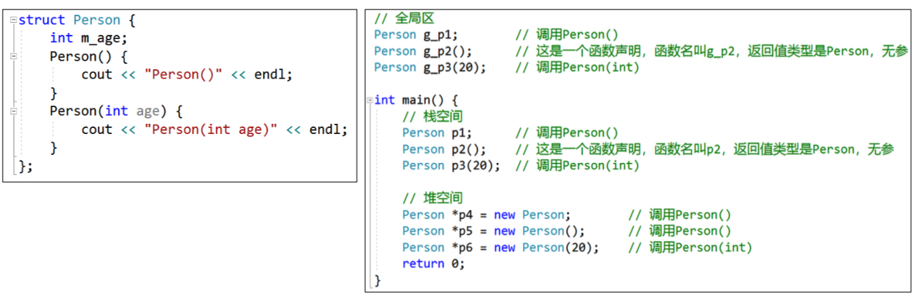
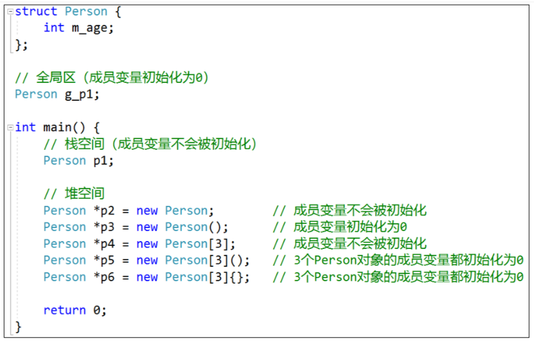
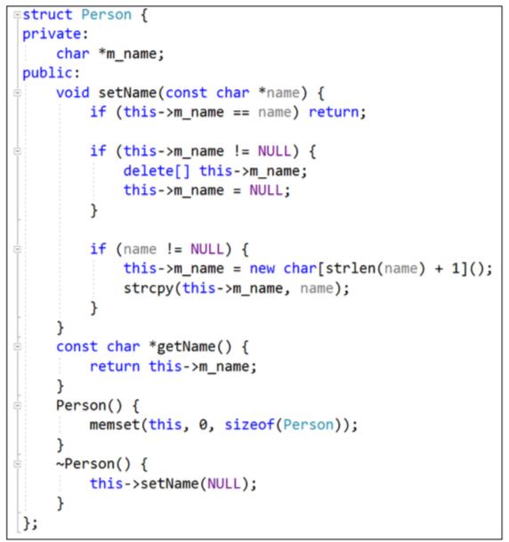
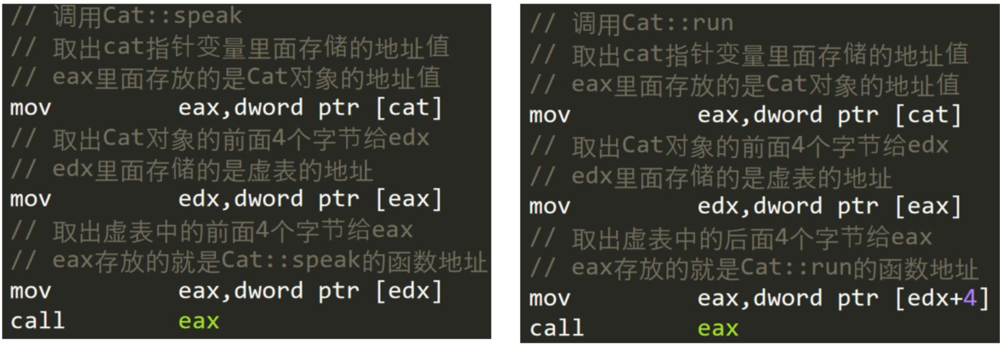
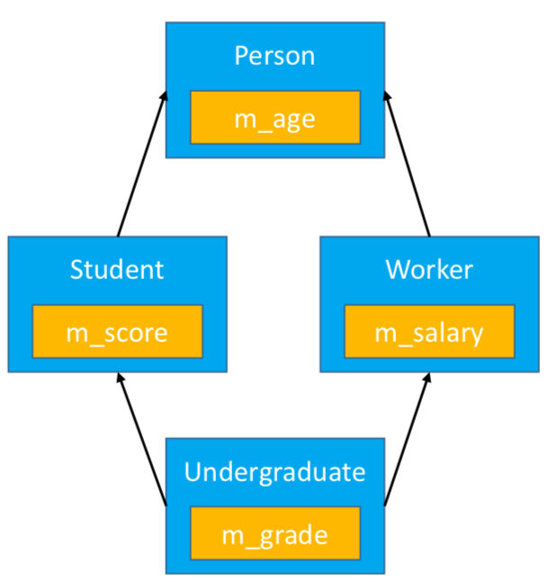
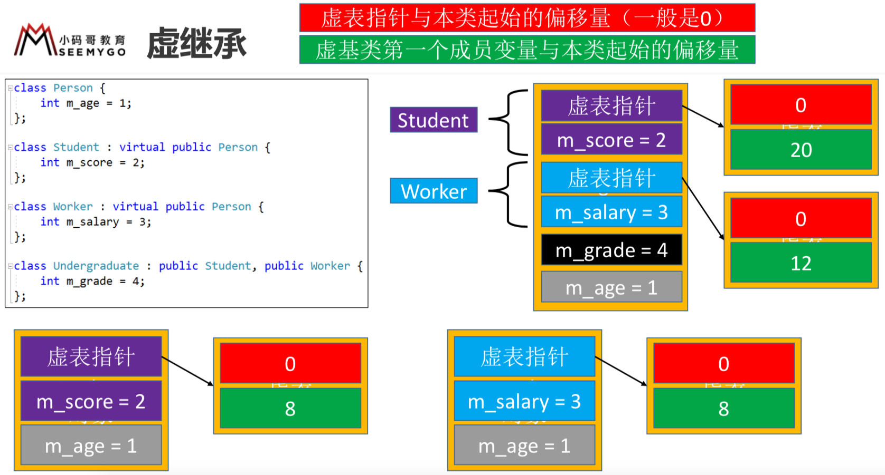
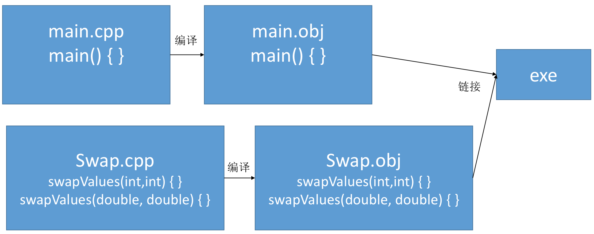

# C++

1. 入口　　main函数，与文件名无关，多个main会报错，java可以有多个入口

2. 完全兼容c

3. C++中常使用cin、cout进行控制台的输入、输出，

    cin用的右移运算符>>，cout用的是左移运算符<<

    endl是换行的意思


### 基本语法

1. **函数重载(Overload)**

   1. 函数名相同

   2. 参数个数不同、参数类型不同、参数顺序不同

   3. 返回值类型与函数重载无关

   4. 调用函数时，实参的隐式类型转换可能会产生二义性

   5. **本质**　采用了name mangling或者叫name decoration技术
      1. C++编译器默认会对符号名(变量名、函数名等)进行改编、修饰，有些地方翻译为“命名倾轧”
      2. 重载时会生成多个不同的函数名，不同编译器(MSVC、g++)有不同的生成规则
      3. 通过IDA打开【VS_Release_禁止优化】可以看到
      4. eg: 

2. **extern “C”**

   1. 被extern "C"修饰的代码会按照C语言的方式去编译

   2. 如果函数同时有声明和实现，要让函数声明被extern "C"修饰，函数实现可以不修饰

   3.  由于C、C++编译规则的不同，在C、C++混合开发时，可能会经常出现以下操作,C++在调用C语言API时，需要使用extern "C"修饰C语言的函数声明. **在c++中声明函数，在c文件中写实现，会按c++ name mangling方式找函数实现，然后报错**。需要**extern "C"**

      ``` 
      extern "C" {
      	#include "sum.h"
      }
      ```

      

   4. 有时也会在编写C语言代码中直接使用extern “C” ，这样就可以直接被C++调用,通过使用**__cplusplus**来区分C、C++环境

3. **默认参数**

4.  C++允许函数设置默认参数，在调用时可以根据情况省略实参。规则如下:
   默认参数只能按照**右到左**的顺序.与**swift**不同，swift有标签，因为**二义性**
   如果函数同时有声明、实现，默认参数只能放在函数声明中，
   默认参数的值可以是常量、全局符号(全局变量、函数名），**参数如果是函数，使用的是指向函数的指针**  

### 内联函数

1. 使用**inline**修饰函数的声明或实现，可以使其变成内联函数
2. 建议声明和实现都加上**inline**
3. 特点

   1. 编译器会将函数直接展开为函数体代码
   2. 减少函数调用开销
   3. 会增大代码体积
4. 尽量不要内联超过10行代码的函数
5. 有些函数即使声明为**inline**也不一定会被编译器内联，如递归函数
6. **与宏的区别**

   1. 内联函数和宏都能减少函数调用开销
   2. 内联函数多了函数特性和语法检测
   3. 传入a++调用不一样

### 文件相关宏

1. 我们经常使用#ifndef、#define、#endif来防止头文件的内容被重复包含
2. 使用#pragma once可以防止整个文件的内容被重复包含
3. 使用#ifndef、#define、#endif受C\C++标准的支持，不受编译器的任何限制
4. 有些编译器不支持#pragma once(较老编译器不支持，如GCC 3.4版本之前)，兼容性不够好
5. 使用#ifndef、#define、#endif可以针对一个文件中的部分代码，而#pragma once只能针对整个文件

### 引用 

1. 在C语言中，使用指针(Pointer)可以间接获取、修改某个变量的值

2. 在C++中，使用引用(Reference)可以起到跟指针类似的功能

   ```
   int age = 20;
   int &rAge = age; //rAge就是一个引用 
   ```

3. 引用相当于是变量的别名(基本数据类型、枚举、结构体、类、指针、数组等，都可以有引用)

    ```
   //指针的引用 
   int a = 10;
   int b = 20;
   int *p = &a;
   int *&rp = p;
   rp = &b;
   *p = 30;
   a:10 b:30 
   //数组的引用 
   int array[] = {10,20,30};
   int (&rArray)[3] = array;// int &rArray[3]看起来像引用数组,数组中放3个引用不存在
   
   int *a[3] 指针数组，[]优先级高，先与p结合成为一个数组，再由int*说明这是一个整型指针数组，它有n个指针类型的数组元素
   int (*a)[3]//该语句是定义一个数组指针，指向含3个元素的一维数组。
   
   函数返回值可以赋值
   int &func() {
       int a = 10;//a是全局变量才有价值
       return a;
   }
   func() = 30
   
   引用交换a和b的值
   
   ```

   对引用做计算，就是对引用所指向的变量做计算
   在定义的时候就必须初始化，一旦指向了某个变量，就不可以再改变，“从一而终”
   可以利用引用初始化另一个引用，相当于某个变量的多个别名
   不存在【引用的引用、指向引用的指针、引用数组】

4. 引用存在的价值之一:比指针更安全、函数返回值可以被赋值

5. **引用的本质就是指针，只是编译器削弱了它的功能，所以引用就是弱化了的指针**

6. 一个引用占用一个指针的大小

#### const

1. 是常量的意思，被其修饰的变量不可修改

2. 如果修饰的是类、结构体(的指针)，其成员也不可以更改

   ```
   int a = 10;
   const int *p = &a;// *p不可以改   
   int const *p1 = &a;// *p1不可以改
   int * const p2 = &a;// p2不可以改
   const int * const p3 = &a; // p3与*p3不可以改
   int const * const p4 = &a; // p4与*p4不可以改
   
   const 修饰的是右边的东西，如果右边带*,则*p是常量，不可以改
   
   const Student *pStu = &stu;
   下面两句报错，const 修饰*pStu 表明pStu所指向的内存是常量，不能修改
   (*pStu).age = 30; 
   pStu->age = 40;
   ```

#### 常引用

1. 引用可以被const修饰，这样就无法通过引用修改数据了，可以称为常引用
2. const必须写在&符号的左边，才能算是常引用

```
int age = 10;
int & const rAge = &age; //const 表明rAge的指向不能改，加不加一个意思 
rAge = 20;通过
int const &rAge2 = &age; // rAge不
rAge2 = 30;报错

```

1. 用法  `const int &rAge = 50;  ` `const int &rAge = a + b`

2. 可以指向临时数据(常量、表达式、函数返回值等)
   可以指向不同类型的数据
   **作为函数参数时(此规则也适用于const指针)**
   ✓ 可以接受const和非const实参(非const引用，只能接受非const实参)
   ✓ 可以跟非const引用构成重载,不是引用加const不会构成重载

   ```
   int sum(const int &a,const int &b) {
       retun a + b;
   }
   ```

3.  指向了不同类型的数据时，会产生临时变量，即引用指向的并不是初始化时的那个变量

#### **数组的引用** 

```
int array[] = {10,20,30}
int (&rArray)[3] = array;
int * const &rArray2 = array;
```


#### 指针汇编 与引用的汇编一样

<figure class="half">
    
</figure>


### 面向对象

#### 类

1. C++中可以使用struct、class来定义一个类

2. struct和class的区别
   **struct**的默认成员权限是**public**    
   **class**的默认成员权限是**private**

   实际开发中，用class表示类比较多

3. 

#### ◼ 变量名规范参考

1. 全局变量:g_
2. 成员变量:m_
3. 静态变量:s_
4. 常量:c_
5. 使用驼峰标识

#### **对象的内存布局**

如果类中有多个成员变量，对象的内存又是如何布局的?

在连续地址存放成员变量，还须考虑内存对齐，其中对象地址是首个成员变量的地址

函数与类没有关系，放在代码区，成员函数会传入当前对象的内存地址

#### **指针访问对象成员的本质**

通过对象首地址+加该成员变量的偏移来访问成员变量

  汇编中 `mov dword ptr  [eax + 4], 10`  偏移4  


#### this

1. **this**是指向当前对象的指针

2. 对象在调用成员函数的时候，会自动传入**当前对象的内存地址**

3. 可以利用this.m_age来访问成员变量么? 

   **不可以**，因为this是指针，必须用this->m_age  			

#### **封装**

1.  成员变量私有化，提供公共的getter和setter给外界去访问成员变量

#### **内存空间的布局**

1. 每个应用都有自己独立的内存空间，其内存空间一般都有以下几大区域   **不同平台顺序不一样**
   1. **代码段(代码区）** 用于存放代码
   2. **数据段(全局区)**   用于存放全局变量等
   3. **栈空间**   每调用一个函数就会给它分配一段连续的栈空间，等函数调用完毕后会自动回收这段栈空间， 自动分配和回收
   4. **堆空间** 需要主动去申请和释放，延长对象生命周期，灵活控制

#### 堆

1. 在程序运行过程，为了能够自由控制内存的生命周期、大小，会经常使用堆空间的内存

2. 堆空间的申请\释放

   1. malloc \ free
   2. new \ delete
   3. new [] \ delete []   使用且new[] 申请数组，必须用delete[] 释放

3. 申请堆空间成功后，会返回那一段内存空间的地址
   申请和释放必须是1对1的关系，不然可能会存在内存泄露

4.  现在的很多高级编程语言不需要开发人员去管理内存(比如Java)，屏蔽了很多内存细节，利弊同时存在

    **利**:提高开发效率，避免内存使用不当或泄露 

   **弊**:不利于开发人员了解本质，永远停留在API调用和表层语法糖，对性能优化无从下手

   #### 堆空间的初始化

   

   **memset**函数是将较大的数据结构(比如对象、数组等)内存清零的比较快的方法

#### **构造函数(**Constructor**)**

构造函数(也叫构造器)，在对象创建的时候自动调用，一般用于完成对象的初始化工作

1. 函数名与类同名，无返回值(void都不能写)，可以有参数，可以重载，可以有多个构造函数

2. 一旦自定义了构造函数，必须用其中一个自定义的构造函数来初始化对象

3. **通过malloc分配的对象不会调用构造函数**,**创建对象时不要使用malloc**

4. **错误**  **~~默认情况下，编译器会为每一个类生成空的无参的构造函数~~**,查看汇编没有调用构造函数

   在某些特定的情况下，编译器才会为类生成空的无参的构造函数

5. 调用，分清构造函数的调用 与 函数的声明

   


​	Person p1(); 是一个函数声明

#### 默认情况下，成员变量的初始化

 

1. 如果自定义了构造函数，除了全局区，其他内存空间的成员变量默认都不会被初始化，需要开发人员手动初始化

2. 对象初始化 

   ```
   Person() {
   	memset(this,0,sizeof(Person));
   }
   ```

   `free(<#void *#>)` 传入的是void * 会释放当初申请的连续空间，与传入的是int *,double * 无关

#### 析构函数

析构函数(也叫析构器)，在对象销毁的时候自动调用，一般用于完成对象的清理工作

1. 函数名以~开头，与类同名，无返回值(void都不能写)，无参，不可以重载，有且只有一个析构函数

2. 通过**malloc**分配的对象**free**的时候不会调用构造函数

3. 构造函数、析构函数要声明为**public**，才能被外界正常使用

4. 对象内部申请的堆空间，由对象内部回收

5. 多注意setter和析构的内存管理 

   

#### 声明和实现的分享

```
class Person {
private:
    int m_age;
public:
    void setAge(int age);
    int getAge();
    Person();
    ~Person();
};
```

```
#include 'Person.hpp'
Person::~Person() {
    cout<<__func__<<endl;
}
Person::Person() {
    memset(this, 0, sizeof(Person));
}
void Person::setAge(int age) {
    this->m_age = age;
}
int Person::getAge() {
    return this->m_age;
}
```

#### 命名空间

命名空间可以用来避免命名冲突，不影响内存布局

```
namespace HL {
	int g_age;
    class Person {
    };
    void test() {
    }
}
int main() {
    HL::g_age = 10;
	HL::test();
	return 0;
}

using namespace HL;
或
HL:Person
```

可以嵌套，合并 

```
namespace HL {
	namespace HL2 {
		int a;
	}
}
HL::HL2::a
```


```
namespace HL {
	int g_age;
}
namespace HL {
	int g_no;
}
等价
namespace HL {
	int g_age;
	int g_no;
}
```


有个默认的全局命名空间，我们创建的命名空间默认都嵌套在它里面

#### 继承

C++中没有像Java、Objective-C的基类

1. 在内存布局中，父类的成员变量在前，子类的成员变量在后  							 						 

2. 访问权限 

   1. public/protected/prvate

   2. 子类内部访问父类成员的权限，是**成员本身的访问权限**和**上一级父类的继承方式**中权限最**小**的那个

   3. 开发中用的最多的继承方式是public，这样能保留父类原来的成员访问权限,

      ```
      struct Student:Public Person{  
      };
      ```


#### **初始化列表**

一种便捷的初始化成员变量的方式，只能用在构造函数中

**初始化顺序**只跟**成员变量的声明顺序**有关 

```
struct Person {
    int m_no;  //先初始化
    int m_age;
    //    Person(int no,int age){
    //        this->m_no = no;
    //        this->m_age = age;
    //    }
    与上面的初始化方式等价
    Person(int no,int age):m_no(no),m_age(age){
    }
	 
	Person():Person(0,0){ 利用初始化列表传入默认值 
    }
    
    //Person(int no = 0,int age = 0):m_no(no),m_age(age){
    //}
};


struct Person {
    int m_no;
    int m_age;
    Person(int no,int age):m_age(age),m_no(m_age){
    //先初始化m_no,m_age没有值 ，
    //再初始化m_age 为
    }
};
Person p(20,180);
m_no:未知  m_age:180
```

如果函数声明和实现是分离的 

1. 初始化列表只能写在函数的实现中 
2. 默认参数只能写在函数的声明中

构造函数调用构造函数必须放在初始化列表

#### **父类的构造函数**

子类的构造函数默认会调用父类的无参构造函数  

◼ 如果子类的构造函数显式地调用了父类的有参构造函数，就不会再去默认调用父类的无参构造函数 

◼ 如果父类缺少无参构造函数，子类的构造函数必须显式调用父类的有参构造函数  	

```
struct Person {
	int m_age;
	Person() :Person(0){
	}
	Person(int age) :m_age(age){
	}
}
Struct Student:Person() {
    int m_no;
    Student():Student(0,0){
    }
	Student(int age,int no):Person(age),m_no(no) {
	}
}
```

#### **父类指针、子类指针**

父类指针可以指向子类对象，是安全的，开发中经常用到(继承方式必须是public)
子类指针指向父类对象是不安全的

#### **多态**  c++是静态语言

◼ 默认情况下，编译器只会根据指针类型调用对应的函数，不存在多态  								

◼ 多态是面向对象非常重要的一个特性

​	 同一操作作用于不同的对象，可以有不同的解释，产生不同的执行结果	

​	 在运行时，可以识别出真正的对象类型，调用对应子类中的函数  								

◼ 多态的要素 

​	子类重写父类的成员函数(override)

​	 父类指针指向子类对象

​	 利用父类指针调用重写的成员函数  	

通过**虚函数virtual**实现多态 

1.  只要在父类中声明为虚函数，子类中重写的函数也自动变成虚函数(也就是说子类中可以省略virtual关键字)

#### 虚表 - 实现多态的原理

虚函数的实现原理是虚表，这个虚表里面存储着最终需要调用的虚函数地址，这个虚表也叫虚函数表

 如果有虚函数，则对象首地址存放的是虚表的首地址,**本质还是指针**，

 下图为x86的图


所有的Cat对象(不管在全局区、栈、堆)共用同一份虚表

**本质**汇编分析



会根据虚表的偏移值来调用不同的虚函数

父类与子类有不同的虚表，这样才能保证多态，如果子类没有实现父类的虚函数A，子类虚表直接存储父类该虚函数A的地址

#### 虚析构函数

含有虚函数的类，应该将析构函数声明为虚函数(虚析构函数)
delete父类指针时，才会调用子类的析构函数，保证析构的完整性

#### **纯虚函数**  

**纯虚函数**：没有函数体且初始化为0的虚函数，用来定义接口规范

抽象类(Abstract Class)

1. 含有纯虚函数的类，不可以实例化(不可以创建对象)
2. 抽象类也可以包含非纯虚函数
3. 如果父类是抽象类，子类没有完全实现纯虚函数，那么这个子类依然是抽象类
4. 可以定义成员变量

```
class Animal {
    virtual void speak() = 0;
}
```

#### 多继承

 C++允许一个类可以有多个父类(不建议使用，会增加程序设计复杂度)

```
多继承下的构造函数
class Undergraduate: public Student, Public Worker {
    Undergraduate(int socre,int salary):Student(socre),Worker(salary) {
    }
}
```

多继承下继承多父类的虚函数，会有**多个虚表**

多继承下的**同名函数** 

```
调用不同的eat函数，其中eat为非虚函数
Undergraduate ug;
ug:Student::eat();
ug:Worker::eat();
ug:Undergraduate::eat();
ug:eat();
```

多继承下的**同名成员变量** 

```
Undergraduate ug;
ug.m_age = 10;
ug.Student::m_age = 20;
ug.Worker::m_age = 30;
```

**菱形继承**

 菱形继承带来的问题

1. 最底下子类从基类继承的成员变量冗余、重复
2. 最底下子类无法访问基类的成员，有二义性




**虚继承**也会生成虚表

虚继承虚基类的成员变量会放在最后面

通过虚继承解决菱形继承问题




#### **静态成员(static)**

静态成员:被static修饰的成员变量\函数 

可以通过对象(**对象.静态成员**)、对象指针(**对象指针->静态成员**)、类访问(**类名::静态成员**)

  ◼ 静态成员变量  

1. 存储在数据段(**全局区**，类似于全局变量)，整个程序运行过程中只有一份内存 
2. 对比全局变量，它可以设定访问权限(public、protected、private)，达到局部共享的目的 
3. 必须初始化，必须在类外面初始化，初始化时不能带static，如果类的声明和实现分离(在实现.cpp中初始化)

 ◼ 静态成员函数  

1. 内部不能使用this指针(this指针只能用在非静态成员函数内部) 
2. 不能是虚函数(虚函数只能是非静态成员函数) 
3. 内部不能访问非静态成员变量\函数，只能访问静态成员变量\函数 
4. 非静态成员函数内部可以访问静态成员变量\函数  
5. 构造函数、析构函数不能是静态 
6. 当声明和实现分离时，实现部分不能带static  	


#### Const成员

const成员:被const修饰的成员变量、非静态成员函数

◼ **const成员变量**
必须初始化(类内部初始化)，可以在声明的时候直接初始化赋值
非static的const成员变量还可以在初始化列表中初始化

◼ **const成员函数(非静态)**
const关键字写在参数列表后面，函数的声明和实现都必须带const
内部不能修改非static成员变量
内部只能调用const成员函数、static成员函数
非const成员函数可以调用const成员函数
const成员函数和非const成员函数构成重载，非const对象(指针)优先调用非const成员函数
const对象(指针)只能调用const成员函数、static成员函数

**引用类型成员**

在声明的时候直接初始化
通过初始化列表初始化

```
class Car{
	int age;
	int &m_price = age;
public:
	Car(Int &price):m_price(price){
```
#### 单例模式

```
class Rocket {
    int name;
private:
    Rocket() { }
    static Rocket *ms_rocket;
    //禁止拷贝构造和赋值操作
    Rocket(const Rocket&)() {};
    Rocket &operator=(const Rocket &rocket){};
public:
    static Rocket *shared() {
    //未考虑的线程安全问题
        if (ms_rocket == NULL) {
            ms_rocket =new Rocket();
        }
        return ms_rocket;
    }
};
Rocket* Rocket::ms_rocket = NULL;  全局变量声明
```

Delete 表示，这块内存被回收，可以被别人使用，并不表示这个内存会清零，被抺掉

野指针表示指向被回收的内存

#### 深拷贝

```
class Car {
    int m_price;
    char *m_name;
     //深拷贝m_name
    void copyName(const char *name) {
        if (name == NULL) return;
        this->m_name = new char[strlen(name) + 1]{};
        strcpy(this->m_name,name)
    }
public:
	Car(int price = 0,const char *name = NULL):m_price(price) {
        copyName(name);
	}
	Car(const Car &car) {
        this->m_price = car.m_price;
        copyName(car.m_name);
	}
	~Car() {
        if (this->m_name != NULL) {
            delete[] this->m_name;
        }
	}
}
```

####拷贝构造函数(Copy Constructor)

◼ 拷贝构造函数是构造函数的一种
◼ 当利用已存在的对象创建一个新对象时(类似于拷贝)，就会调用新对象的拷贝构造函数进行初始化
◼ 拷贝构造函数的格式是固定的，接收一个const引用作为参数
◼ 通过初始化列表调用父类的拷贝构造函数

```
Car(const car &car){
}
```

```
Car car(100,"bmw")
Car car2 = car;
Car car3(Car2);
Car car4;
car4 = car3;赋值操作，默认浅复制
//car2 ,car3拷贝构造函数，car,car4不是

```

**浅拷贝、深拷贝**

◼编译器默认的提供的拷贝是浅拷贝(shallow copy) 

将一个对象中所有成员变量的值拷贝到另一个对象 

如果某个成员变量是个指针，只会拷贝指针中存储的地址值，并不会拷贝指针指向的内存空间 

可能会导致堆空间多次free的问题  								

◼如果需要实现深拷贝(deep copy)，就需要自定义拷贝构造函数 

将指针类型的成员变量所指向的内存空间，拷贝到新的内存空间  							 						 					

对象参数和返回值  

◼ 使用对象类型作为函数的参数或者返回值，可能会产生一些不必要的中间对象

```
class Car {
    int m_price;
public:
	Car(){}
	Car(int price):m_price(price){}
	Car(const Car &car):m_price(car.m_price) {}
};
void test1(Car car){
}
Car test2() {
    Car car(20); // Car(int price)
    return car;  //外面使用时会调用拷贝构造函数，确实返回的对象在堆空间
}
Car car1(10);//Car(int price)
test1(car1); //Car(const Car &car);
Car car2 = test2();//Car(const Car &car);
Car car3(30);//Car(int price)
car3 = test2();//Car(const Car &car);
```

#### 匿名对象

匿名对象：没有变量名、没有被指针指向的对象，用完后马上调用析构

使用匿名对象直接调用构造函数，不再调用拷贝构造函数

```
void test1(Car car){
}
Car test2() {
    return Car(20);
}
test1(Car(40));//Car(int price)
Car car3(50);
car3 = test2();//Car(int price)
```

隐匿构造

C++中存在隐式构造的现象:某些情况下，会隐式调用**单参数**的构造函数

```
void test1(Car car){ //传10
}
Car test2() {
    return 10;
}
Car car = 10;
```


可以通过关键字**explicit**禁止掉隐式构造

```
explicit Car(int price):m_price(price) {}
```


#### 编译器自动生成的构造函数

◼ C++的编译器在**某些特定**的情况下，会给类自动生成无参的构造函数，比如

成员变量在声明的同时进行了**初始化**
有定义虚函数，需要设置虚表
虚继承了其他类
包含了**对象类型的成员**，且这个成员有构造函数(编译器生成或自定义)   指针类型成员不需要
父类有构造函数(编译器生成或自定义)

对象创建后，需要做一些额外操作时(比如内存操作、函数调用)，编译器一般都会为其自动生成无参的构造函数 

#### **友元**

◼ 友元包括友元函数和友元类


friend Point add(const Point &,const Point &)//友元函数
friend class Math;//友元类

◼ 如果将函数A(非成员函数)声明为类C的友元函数，那么函数A就能直接访问类C对象的所有成员
◼ 如果将类A声明为类C的友元类，那么类A的所有成员函数都能直接访问类C对象的所有成员
◼ 友元破坏了面向对象的封装性，但在某些频繁访问成员变量的地方可以提高性能

#### **内部类**

◼ 如果将类A定义在类C的内部，那么类A就是一个内部类(嵌套类)
◼ 内部类的特点
支持public、protected、private权限
成员函数可以直接访问其外部类对象的所有成员(反过来则不行)
成员函数可以直接不带类名、对象名访问其外部类的static成员
不会影响外部类的内存布局
可以在外部类内部声明，在外部类外面进行定义

```
声明和实现分离
class Point{
    class Math{
        void test();
    }
};
void Point::Math::test() {
}
-------
class Point {
    class Math;
};
class Point::Math{
    void test(){}
};
-------
class Point{
    class Math;
};
class Point::Math{
    void test();
}
void Point::Math::test() {}
```

#### **局部类**

◼ 在一个函数内部定义的类，称为局部类
◼ 局部类的特点
作用域仅限于所在的函数内部
其所有的成员必须定义在类内部，不允许定义**static**成员变量
成员函数不能直接访问函数的局部变量(static变量除外)

内部类与局部类的权限/作用域与普通类不同


### 其他语法

#### 运算符重载 **(operator overload)**

全局函数、成员函数都支持运算符重载

```
全局函数--1.使用const，const与非const都可以调用这个函数 2.使用&不会调用拷贝构造函数
Point operator+(const Point &p1,const Point &p2){
    return Point(p1.m_x + p2.m_x,p1.m_y + p2.m_y);
}
class Point {
	成员函数
    Point operator+(const Point &point){//const
    	return Point(this->m_x + point.m_x,this->m_y + point.m_y);
	}
	//直接返回对象会调用拷贝构造函数，所以加引用，而且加引用后是安全的，因为this仍然存在
	Point &operator+=(const Point &point){
		this->m_x += point.m_x;
		this->m_y += point.m_y;
    	return *this;
	}
	//第一个const使用结果不能被赋值,即-p不能被赋值，没有意义，第二个const表明这是一个const函数，const成员可以调用`-(-p)`
	const Point operator-() const {
		return Point(-this->m_x,-this->m_y);
	}
};
```


#### 运算符重载

注意点：

◼ 有些运算符不可以被重载，比如 

```
1. 对象成员访问运算符:. 
2. 域运算符:::
3.  三目运算符:?:
4. sizeof 
```

◼ 有些运算符只能重载为成员函数，比如

```
1.赋值运算符:=
2.下标运算符:[ ]
3.函数运算符:( )
4.指针访问成员:->
```


```
//前++
void operator++() {
    this->m_x++;
    this->m_y++;
}
//后++
void operator++(int) { //int是语法问题
}
```
```
b = ++a + 8;  
mov eax,dword ptr [a]    //eax = a
inc eax    				 // eax += 1
mov dword ptr [a],eax    // a = eax
mov eax,dword ptr [a]    // eax = a
add eax,8				 // eax +=  8
mov dword ptr [b],eax    // b = eax

b = a++ + 8;
mov eax,dword ptr [a]    // eax = a
add eax,8				 // eax += 8
mov dword ptr [b],eax 	 // b = eax
mov eax,dword ptr [a]    // eax = a
inc eax					 // eax += 1
mov dwrod ptr [a],eax	 // a = eax

++a 会直接让a的值+1，并且返回最新的a进行运算
a++ 会返回a以前的值进行运算，运算完毕之后才会让a的值+1

```

```
const Point operator++(int) {  //const 返回的值不能改
	Point Point(this->m_x,this->m_y);
	this->m_x++;
	this->m_y++;
	return point;
}
```

```
全局函数 重载<<函数
ostream &operator<<(ostream &cout, const Point &point) {
    return cout<<"("<<point.m_x<<","<<point.m_y<<")";
}
```


`a++` 与`++a`


```
String str1 = "123";
cout<<str1<<endl;   //123
str1 = "222";
cout<<str1<<endl; 	//\300[\377\256
//造成两个问题
1. str1 = "222";会产生一个临时对象，释放时会调用析构函数，造成str1指向错误的字符串
2. str1 原来指向的“123”无法释放

//解决方式
String &String::operator=(const char * cstring){
    if (this->m_cstring) {
        delete [] this->m_cstring;
        this->m_cstring = NULL; //需要指NULL
    }
    if (cstring) {
        this->m_cstring = new char[strlen(cstring) + 1];
        strcpy(this->m_cstring, cstring);
    }
    return *this;
}

```


#### 仿函数

```
class Sum {
    public:
    int operator()(int a,int b ){
        return a + b;
    }
}
```


#### 模板(template)

◼ 泛型，是一种将类型参数化以达到代码复用的技术，C++中使用模板来实现泛型 ，帮你生成不同的函数

◼ 模板的使用格式如下  								

template <typename\class T> 

typename和class是等价的  								

◼ 模板没有被使用时，是不会被实例化出来的，不会生成函数

◼ 模板的声明和实现如果分离到.h和.cpp中，会导致链接错误 

◼ 一般将模板的声明和实现**统一放到一个.hpp**文件中  	

单独编译template .cpp文件时，不会生成函数实现

​


多参数模板

```
template <class T1,class T2> 
void display(const T1 &v1,const T2 &v2) {
    cout << v1 <<endl;
	cout << v2 <<endl;
}
display(20,1.7)
```


​						 				


#### 类模板


#### 类型转换 c++风格

1. Static_cast 

   1. 对比dynamic_cast ,缺乏运行时检测
   2. 不能交叉转换，不再继承体系不能转换
   3. 常用于基本数据类型转换，及非const 转成const
   4. 使用范围比较广，和不写类似

2. const_cast

   ```
   const Person *p1 = new Person();
   Person *p2 = const_cast<Person *>(p1);
   p2->m_age = 20;
   
   Person *p2 = (Person *)p1; //c语言风格
   ```

3. dynamic_cast 用于多态类型检测,赋值不安全时，赋值NULL空指针

   ```
   class Student: Person {}; //继承
   Person *p1 = new Student();
   Student *stu1 = dynamic_cast<Student*> p1;
   
   c语言风格会直接赋值，没有那么安全
   ```

4. reinterpret_cast

   1. 属于比较底层的强制转换，没有任何类型检查和格式转换，仅仅简单的二进制数据拷贝

   2. 可以交叉转换

   3. 可以将指针和整数互相转换

      ```
      int i = 10;
      double d = i;//不是简单的二进制拷贝，int与浮点类型存储方式不同
      
      int i = 10;
      double d = reinterpret_cast<double&> i;  //要加&语法糖
      d的结果不是10， 
      
      int *p = reinterpret_cast<int *>(100);
      int i = reinterpret_cast<int>(p);
      ```

      


C++新特性

#### c++11

1. atuo

   1. 可以从初始化表达式中推断出变量的类型，大大简化编程工作

   2. 属于编译器特性，不影响最终的机器码质量，不影响运行效率

      ```
      //int i = 10;
      auto i = 10; 
      auto p = new Person();
      ```

2. decltype 可以获取变量 `int a = 10; decltype(a) b = 20;`

3. Nullptr 空指针，可以解决二义性问题

   ```
   void func(int *p){ cout<<"func(int *) - "<<endl; }
   func(nullptr);
   ```

4. 快速遍历

   ```
   int array[] = { 1,2,3,4};
   for (int item:array)  {
       cout << item <<endl;
   }
   ```

5. 更简洁的初始化方式

   ```
   int array[]{11,22,33};
   ```

6. lambda表达式

   1. 有点类似js中的闭包，ios中block，本质就是函数

   2. `[capture list](params list)mutable exceptionn-> return {function body}`

      ```
      int (*p)(int,int) = [](int a,int b) -> int {
          return a + b;
      };
      cout<<p(10,20)<<endl;
      
      int a = 10;
      int b = 20;
      [a,b] {
      	cout << a << endl;    
      	cout << b << endl;    
      }
      //a,b最新的值
      [&a,&b] {
          cout  << a <<endl;
          cout  << b <<endl;
      }
      [=]{  默认值捕获，&默认引用捕获
      }
      ```

C++14

1. 泛型lambda表达式

2. ```
   auto func = [](auto v1,auto v2) {return v1 + v2 };
   cout << func(10,20.5)<<endl;
   ```

3. 对捕获变量初始化

   ```
   int a;
   auto func = [a = 10]() {
       cout << a << endl;
   }
   func();
   //这里仍然未初始化
   cout << a << endl;
   ```

4. If else作用域


#### 错误

1. 语法错误
2. 逻辑错误
3. 异常
4. 其他错误

#### 异常

程序运行过程中发生的一种



###栈桢

1. 保护寄存器的值，push pop

const可以调用static

[感谢MJ编程内功必备之30小时快速精通C++和外挂实战](https://ke.qq.com/course/336509)


oc 多态 与swift不同

```

```