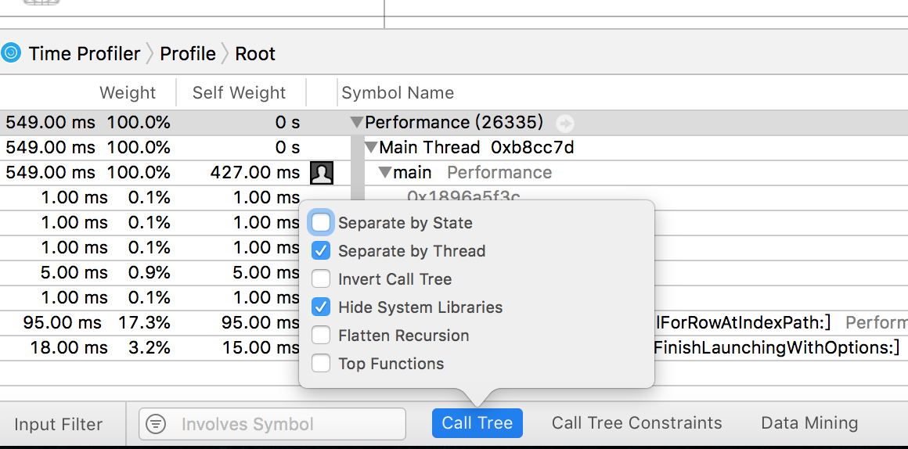

#Core Animation

[TOC]

**Core Animation是一个复合引擎，它的职责就是尽可能快地组合屏幕上不同的可视内容，这个内容是被分解成独立的图层，存储在一个叫做图层树的体系之中。于是这个树形成了UIKit以及在iOS应用程序当中你所能在屏幕上看见的一切的基础。**

###图层树　

1. UIView
  * 处理触摸事件
  * 可以支持基于Core Graphics绘图
  * 仿射变换（CGAffineTransform 旋转或者缩放）
  * 简单的类似于滑动或者渐变的动画。
  * **自动排版，布局和事件处理**
2. CALayer
  * 被层级关系树管理的矩形块
  * 可以包含一些内容（像图片，文本或者背景色）
  * 管理子图层的位置
  * 一些方法和属性用来做动画和变换
  * **CALayer特殊功能**
    * 阴影，圆角，带颜色的边框
    * 3D变换
    * 非矩形范围
    * 透明遮罩
    * 多级非线性动画
  * **区别与联系**
    * 与UIView最大的不同是CALayer不处理用户的交互。
    * UIview对应一个CALayer实例的图层属性，即backing layer，视图的职责就是创建并管理这个图层，以确保当子视图在层级关系中添加或者被移除的时候，他们关联的图层也同样对应在层级关系树当中有相同的操作
    * 关联的图层才是真正用来在屏幕上显示和做动画，UIView仅仅是对它的一个封装，提供了一些iOS类似于处理触摸的具体功能，以及Core Animation底层方法的高级接口。
3. **模型层树** 　layer静止不动画时的所有属性
   * 任何时候你改变一个layer的值时，都在更新它的模型层。模型层上的值不会在动画过程中改变，并会持续反应你添加动画前的值。
4. **表现层树**　动画时layer上的属性，并包含了运行动画时的变化值
   * 准确了解一个layer在哪或是其在动画过程中的行为时通过查看当前的动画值来与表现层树交互
5. **渲染树**   苹果的私有值集合，用来执行渲染到屏幕上的实际绘制

### 寄宿图  

1. CALayer.content 属性,类型为CGImage
2. CALayer.contentGravity　对应　UIView.contentMode 　
3. CALayer.contentsScale:寄宿图的像素尺寸和视图大小的比例 对应UIView.contentScaleFactor 
4. CALayer.contentsRect:单位坐标　图片被画入layer的范围，可以裁剪图片一部分内容，默认Rect(0,0,1,1),x,y可以为负,w,h可以大于1。其中w,h>1　控制图片大小　x,y控制方向
5. CALayer.maskToBounds
  **使用CALayer.content设置图片需注意设置contentGravity及contentsScale**
6. CALayer.contentsCenter:单位Rect　拉申范围和resizableImageWithCapInsets类似，更可以在nib中配置stretching
7. CALayerDelegate )可以绘制一些东西，需要手动调用layer.display  　UIView创建了它的宿主图层时，它就会自动地把图层的delegate设置为它自己，并提供了一个-displayLayer:的实现，
8. *drawRect:方法创建的就是CALayer的寄宿图。*
> 点 —— 被称作逻辑像素。标准清晰度下一个点就是一个像素，但Retina设备上，一个点等于2*2个像素。iOS用点作为屏幕的坐标测算体系为了在Retina设备和普通设备上能有一致的视觉效果。

> 像素 —— 物理像素坐标并不会用来屏幕布局，但可以处理图片，UIImage可以识别屏幕分辨，并以点为单位指定其大小。但是一些底层的图片表示如CGImage就会使用像素，所以你要清楚在Retina设备和普通设备上，它们表现出来了不同的大小。  

>单位 —— 对于与图片大小或是图层边界相关的显示，单位坐标是一个方便的度量方式， 当大小改变的时候，也不需要再次调整。单位坐标在OpenGL这种纹理坐标系统中用得很多，Core Animation中也用到了单位坐标。


###图层几何学

UIView  |  CALayer | 意义
--------|----------|-----
frame   | frame    |在父图层上占据的空间 
bounds  | bounds   |内部坐标
center  | position |相对父图层anchorPoint的位置

UIView的frame、bounds、center仅仅只是存取方法，实际是改变CALayer的frame  
对于视图或者图层来说，frame并不是一个非常清晰的属性，它其实是一个虚拟属性，是根据bounds，position和transform计算而来，所以当其中任何一个值发生改变，frame都会变化。相反，改变frame的值同样会影响到他们当中的值


1. anchorPoint 锚点
  * 默认位于图层的中点　即{0.5,0.5}
  * anchorPoint改变，会改变frame的x,y，使用position相对anchorPoint的值不变，可以先算view.center，然后把center移到锚点位置
  * 应用比如说**时钟动画**
  
2. 坐标系转换

  ```
  - (CGPoint)convertPoint:(CGPoint)point fromLayer:(CALayer *)layer; 
  - (CGPoint)convertPoint:(CGPoint)point toLayer:(CALayer *)layer; 
  - (CGRect)convertRect:(CGRect)rect fromLayer:(CALayer *)layer;
  - (CGRect)convertRect:(CGRect)rect toLayer:(CALayer *)layer;
  ```
  
  convertPoint直接示例，把A上的点转换到B上：
  
  ```
  [A convertPoint:point toView:B]；
  
  [B convertPoint:point fromView:A];
  
  注意：point坐标的参考系是A视图，A和B的视图层次不需要关系。
  ```
  
  convertRect直接示例，把A的frame转换到B上：
  
  ```
  [A convertRect:A.bounds toView:B];
  //        这里使用A.frame 则转换之后的rect会比用bounds多个x,和y的值
  
  [B convertRect:A.bounds fromView:A];
  
  注意：****rect需要相对于A（同上一样，bounds就是A相对于自身的frame），A和B的视图层次不需要关系。
  ```
  
3. CALayer.geometryFlipped 

  * if true  子视图垂直翻转
  
4. CALayer中Z坐标轴 （三维空间）
  * zPosition　改变图层的显示顺序了，越大就越显示在上，但不处理响应事件,
  * anchorPointZ　锚点z轴，
  
5. CALayer -hitTest:方法接受一个CGPoint类型参数，而不是BOOL类型，它返回图层本身，或者包含这个坐标点的叶子节点图层

6. 自动布局
  * UIView通过指定组合形成线性方程组和不等式的约束，定义视图的位置和大小。
  * autoresizingMask　横竖屏用的较多
  * 约束　　各种地方都有


###视学效果　CALayer
1. shadowOffset　默认(0, -3)　向上
2. 阴影裁剪　**maskToBounds属性裁剪掉了阴影和内容**
	解决办法：外层阴影图层，内层裁剪内容图层
3. shadowPath　任意阴影形状
4. **图层蒙板mask**　 图层实心部分被保留下来，其他的被抛弃，通常mask = layer(其中layer是一个content为png图片的layer)
	* 用来显示png图片中非透明的部分
5. minificationFilter　与　magnificationFilter拉伸过滤方法
	* kCAFilterLinear default  性滤波算法
	* kCAFilterNearest 最近过滤
	* kCAFilterTrilinear 三线性滤波算法
	* 对于没有斜线的小图来说，最近过滤算法要好很多,线性过滤保留了形状，最近过滤则保留了像素的差异。
	 
	 
6. 组透明 很奇怪可能和ios版本有关

###变换

#### 仿射变换

仿射变换

1. CGAffineTransform是一个可以和二维空间向量（例如CGPoint）做乘法的3X2的矩阵
  * 要解释一下图中显示的灰色元素，为了能让矩阵做乘法，左边矩阵的列数一定要和右边矩阵的行数个数相同，所以要给矩阵填充一些标志值，使得既可以让矩阵做乘法，又不改变运算结果，并且没必要存储这些添加的值，因为它们的值不会发生变化，但是要用来做运算。
  
  * “仿射”的意思是无论变换矩阵用什么值，图层中平行的两条线在变换之后任然保持平行
  

2. CALayer的affineTransform　对应于UIView的transform

3. 混合变换　如既要*缩放*又要*旋转*的变换
  * CGAffineTransformIdentity
  * CGAffineTransformConcat(CGAffineTransform t1, CGAffineTransform t2);
  * **上一个变换的结果将会影响之后的变换**，变换的顺序会影响最终的结果，也就是说旋转之后的平移和平移之后的旋转结果可能不同。

4. 斜切变换

  ```
  CGAffineTransform CGAffineTransformMakeShear(CGFloat x, CGFloat y)
  {
    CGAffineTransform transform = CGAffineTransformIdentity;
    transform.c = -x;
    transform.b = y;
    return transform;
  }
  - (void)viewDidLoad
  {
    [super viewDidLoad];
    //shear the layer at a 45-degree angle
    self.layerView.layer.affineTransform = CGAffineTransformMakeShear(1, 0);
  }
  ```


#### 3D变换

1. CATransform3D 
   
   

* 透视投影  m34 用于按比例缩放X和Y的值来计算到底要离视角多远。  通过设置m34为-1.0 / d来应用透视效果，d代表了想象中视角相机和屏幕之间的距离，以像素为单位 通常500-1000 设置之后有3D效果
* 下图表示绕y轴旋转下　m34起的作用
* 　
*  


6. 灭点
	* 远离相机视角的物体将会变小变远，当远离到一个极限距离，它们可能就缩成了一个点，于是所有的物体最后都汇聚消失在同一个点。
	* 
	* Core Animation定义了灭点位于变换图层的anchorPoint,，当图层发生变换时，这个点永远位于图层变换之**前**anchorPoint的位置。
	* 当改变layer的position，也改变了它的灭点，当你试图通过调整m34来让它更加有3D效果时，应该首先把它放置于屏幕中央，然后通过平移来把它移动到指定位置（而不是直接改变它的position），这样所有的3D图层都共享一个灭点。
7. sublayerTransform:对一个图层的变换不同，它**影响到所有的子图层**。可以一次性对包含这些图层的容器做变换，所有子图层都自动继承了这个变换方法。
8. 背面　y轴旋转M_PI
	* doubleSided default　YES，　if no　不能背面显示，不再渲染视图后面的内容
9. 扁平化图层
	* 如果对包含已经做过变换的图层的图层做反方向的变换将会发什么什么呢？
	* **抵消恢复正常状态并不对**　z轴变换对，二维空间
	* y轴变换　
	* 
	* 尽管Core Animation图层存在于3D空间之内，但它们并不都存在同一个3D空间。每个图层的3D场景其实是扁平化的，当你从正面观察一个图层，看到的实际上由子图层创建的想象出来的3D场景，但当你倾斜这个图层，你会发现实际上这个3D场景仅仅是被绘制在图层的表面。
10. 固体对象　(正方体) 
	* **角度** 即使设置了m34，有时仍需从不同的角度来看
	* 
	* 即使实现了立体效果但感觉没有opnegl专业
	* 点击事件注意图层顺序，与视觉效果不一样

###专用图层
#### CAShapeLayer

* 通过矢量图形而不是bitmap(栅格图)来绘制的图层子类
* 渲染快速 CAShapeLayer使用了硬件加速，绘制同一图形会比用Core Graphics快很多。
* 可以超出图层边界　但masksToBounds仍然起作用
* 不会出现像素化 放大，或用3D透视变换将其离相机更近时,不会出现像素化
* CAShapeLayer.path　与UIBezierPath等配合

#### CATextLayer

* CATextLayer也要比UILabel渲染得快得多
* iOS 6及之前 UILabel其实是通过WebKit来实现绘制的
* textLayer.contentsScale = [UIScreen mainScreen].scale; **解决retain像素化问题**　
* LayerLabel 用CATextLayer　替换label的_LabelLayer 实现albel
* 可以加载富文本

#### CATransformLayer 

* 不同于普通的CALayer,不显示它自己的内容
* CATransformLayer.addSublayer构造一个层级的3D结构

#### CAGradientLayer

* locations与colors数组大小一致　多重渐变

#### CAReplicatorLayer

* instanceCount指定了图层需要重复多少次
* instanceTransform指定了一个CATransform3D3D变换（这种情况下，下一图层的位移和旋转将会移动到圆圈的下一个点）。
* 反射 负比例变换于一个复制图层 [开源项目](https://github.com/nicklockwood/ReflectionView)

```
transform = CATransform3DScale(transform, 1, -1, 0);
replicatorLayer.instanceTransform = transform;
```

#### CAScrollLayer

* 可以用它自己实现一个scrollView

```
- (void)pan:(UIPanGestureRecognizer *)recognizer
{
  //get the offset by subtracting the pan gesture
  //translation from the current bounds origin
  CGPoint offset = self.bounds.origin;
  offset.x -= [recognizer translationInView:self].x;
  offset.y -= [recognizer translationInView:self].y;
  
  //scroll the layer
  [(CAScrollLayer *)self.layer scrollToPoint:offset];

  //reset the pan gesture translation
  [recognizer setTranslation:CGPointZero inView:self];
}
```

#### CATiledLayer

* 超级大图，切割成小图，通过CALayerDelegate加载
* tileSize是以像素为单位，而不是点
* contentsScale retina
* 增大了contentsScale就自动有了默认的小图尺寸（现在它是128*128的点而不是256*256）

#### CAEmitterLayer 高性能的粒子引擎

* 是CAEmitterCell的容器
* CAEmitterCell定义了粒子效果
	* color混合图片内容颜色的混合色
	* emissionRange　角度
	* alphaSpeed 如－0.4=>每秒就是减少alpha0.4

#### CAEAGLLayer 是CALayer的一个子类，用来显示任意的OpenGL图形

#### AVPlayerLayer (AVFoundation框架）

* 并不会受限于要在一个矩形中播放视频

###隐式动画 layer层
1. 改变CALayer一个可做动画的属性时，这个改变并不会立刻在屏幕上体现出来。相反，该属性会从先前的值平滑过渡到新的值
2. 动画执行的时间取决于当前事务的设置(默认0.25)，动画类型取决于图层行为。
3. Core Animation在每个run loop周期中自动开始一次新的事务（run loop是iOS负责收集用户输入，处理未完成的定时器或者网络事件，最终重新绘制屏幕的东西），即使你不显式地使用[CATransaction begin]开始一次事务，在一个特定run loop循环中的任何属性的变化都会被收集起来，然后做一次0.25秒的动画。
4. 事务 CATransaction　结束时可以添加回调

  ```
    [CATransaction begin];
    //set the animation duration to 1 second
    [CATransaction setAnimationDuration:1.0];
    //add the spin animation on completion
    [CATransaction setCompletionBlock:^{
  	//code
    }];
    //do something 
    //code
    
   //commit the transaction
    [CATransaction commit];
  ```

5. 隐式动画会被UIView关联图层给禁用了　使用了delegate
6. 隐式动画原理 CALayer的属性被修改时，会调用-actionForKey:方法，传递属性的名称
  * 检测有没有delegate && 实现-actionForLayer:forKey方法　有，那就走delegate
  * 没有　图层检查包含属性名称对应行为映射的actions字典
  * actions字典没有包含对应的属性，那么图层接着在它的style字典接着搜索属性名。
  * 果在style里面也找不到对应的行为，那么图层将会直接调用定义了每个属性的标准行为的-defaultActionForKey:方法。
  * 1.检查代理。2检查actions/style字典中行为，3.默认行为
7. 关闭隐匿动画：[CATransaction setDisableActions:YES];
8. 动画过渡方式　利用layer.actions

  ```
    //add a custom action
    CATransition *transition = [CATransition animation];
    transition.type = kCATransitionPush;
    transition.subtype = kCATransitionFromLeft;
    self.colorLayer.actions = @{@"backgroundColor": transition};
    
  ```
  
9. 呈现与模型
  * 改变一个图层的属性，属性值的确是立刻更新的（读取它的数据，会发现在你设置它的那一刻就已经生效了），但屏幕上没有马上发生改变。这是因为你设置的属性并没有直接调整图层的外观，相反，他只是定义了图层动画结束之后将要变化的外观。
  * CALayer是一个连接用户界面（就是MVC中的view）虚构的类
  * 界面本身这个场景下，CALayer的行为更像是存储了视图如何显示和动画的数据模型
  * **模型图**：将要到达的位置
  * **呈现图** -presentationLayer 是模型图层的复制,通过呈现图层的值来获取当前屏幕上真正显示出来的值 
  	* 第一次在屏幕上显示）的时候创建
  	* 
  	* 动画的图层响应用户输入来判断指定图层是否被触摸 应使用呈现图层，呈现图层代表了用户当前看到的图层位
  	* 如[layer.presentationLayer hitTest:point] 是否点击了呈现图，动画中的图层
  	* 基于定时器的动画，准确地知道在某一时刻看到的图层(呈现图)更有意思　

###显式动画

####属性动画(基础和关键帧)

1. CABasicAnimation
  * id fromValue 
  * id toValue 
  * id byValue
  * 动画结束之后会变回原始值，只改变了呈现图，没有改变模型图　解决办法

  ```
  	法一：
  	//动画结束之后layer保持结束状态
  	.removedOnCompletion = NO;
  	//动画结束之后layer的状态将保持在动画的最后一帧
  	.fillMode = kCAFillModeForwards;
  	法二：开始或结束之前，设置终状态属性
  	- (void)applyBasicAnimation:(CABasicAnimation *)animation
                    toLayer:(CALayer *)layer
  {
    //set the from value (using presentation layer if available)
    animation.fromValue = [layer.presentationLayer ?: layer
                           valueForKeyPath:animation.keyPath];
    
    //update the property in advance
    //note: this approach will only work if toValue != nil
    [CATransaction begin];
    [CATransaction setDisableActions:YES];
    [layer setValue:animation.toValue forKeyPath:animation.keyPath];
    [CATransaction commit];
    
    //apply animation to layer
    [layer addAnimation:animation forKey:nil];
  }
  //替换- addAnimation:
  ```
  * 
2. CAAnimationDelegate 
  * 可以知道显式动画在何时结束，但多个动画判断麻烦
  *  CAAnimation有一个与众不同的特性：它更像一个NSDictionary可以随意设置键值对[animation setValue:handView forKey:@"handView"];
3. 关键帧动画
  * 根据一连串随意的值来做动画。
  * CGPath
  * rotationMode 可以根据曲线自动旋转，　试了一下，图片初始方向需向右　
4. 虚拟属性　如：transform.rotation
  * 可以不通过关键帧一步旋转多于180度的动画。
  * 可以用相对值byValue而不是绝对值旋转toValue
  * 不会和其他虚拟属性如：transform.position冲突
5. 动画组　CAAnimationGroup

  * animations组合多个动画
6. 过渡 CATransition　也继承CAAnimation
  * type
  	* kCATransitionFade 
  	* kCATransitionMoveIn 
  	* kCATransitionPush 
  	* kCATransitionReveal
  * subtype 动画方向
  	* kCATransitionFromRight 
  	* kCATransitionFromLeft 
  	* kCATransitionFromTop 
  * 和属性动画不同的是，对指定的图层一次只能使用一次CATransition
  * 隐式过渡　对自己创建的图层contents图片做的改动都会自动附上淡入淡出的动画。
  * 有时可以将动画添加到被影响图层的superlayer
  *　其他过渡选项
  ```
  +transitionWithView:duration:options:animations:
  ```
  * 自定义过渡效果
     * 截图当前转成image
     * 自定义过渡效果，完成之后移除之前图片
    * 移除动画
    ```
    (CAAnimation *)animationForKey:(NSString *)key;
    (void)removeAnimationForKey:(NSString *)key;
    ```
  * 暂停动画

    ```
    // 当前时间（暂停时的时间）
    CFTimeInterval pauseTime = [self.layer convertTime:CACurrentMediaTime() fromLayer:nil];
    // 停止动画
    self.layer.speed = 0;
    // 动画的位置（动画进行到当前时间所在的位置，如timeOffset=1表示动画进行1秒时的位置）
    self.layer.timeOffset = pauseTime;		 
    ```
    * 恢复动画

    ```
    // 动画的暂停时间
    CFTimeInterval pausedTime = self.layer.timeOffset;
    // 动画初始化
    self.layer.speed = 1;
    self.layer.timeOffset = 0;
    self.layer.beginTime = 0;
    // 程序到这里，动画就能继续进行了，但不是连贯的，而是动画在背后默默“偷跑”的位置，如果超过一个动画周期，则是初始位置
    // 当前时间（恢复时的时间）
    CFTimeInterval continueTime = [self.layer convertTime:CACurrentMediaTime() fromLayer:nil];
    // 暂停到恢复之间的空档
    CFTimeInterval timePause = continueTime - pausedTime;
    // 动画从timePause的位置从动画头开始
    self.layer.beginTime = timePause;
    ```
  ```
  
  ```

###图层时间　CAMediaTiming协议

* CAMediaTiming定义了在一段动画内用来控制逝去时间的属性的集合

* CALayer和CAAnimation都实现了CAMediaTiming，时间可以被任意基于一个图层或者一段动画的类控制。

* beginTime　动画开始之前的的延迟时间

* speed　默认1　为0可以暂停

* timeOffset 动画快进到某一点,控制动画进度

* beginTime，timeOffset和speed属性将会影响到子动画

* fillMode　当动画不再播放的时候就显示图层模型指定的值　需和removeOnCompletion配合使用

* autoreverses ：plays backwards after playing forwards

* CACurrentMediaTime　全局马赫时间

* 时间转换　

  ```
  - (CFTimeInterval)convertTime:(CFTimeInterval)t fromLayer:(CALayer *)l; 
  - (CFTimeInterval)convertTime:(CFTimeInterval)t toLayer:(CALayer *)l;
  ```
  * 手动控制动画进程
    * speed = 0; timeoffset = x; 

###缓冲 CAMediaTimingFunction
1. CAAnimation/CATransaction/UIView动画都可以
2. CAKeyframeAnimation.timingFunctions个数等于keyframes数组个数减一，它是描述每一帧之间动画速度的函数
3. 
4. 闹钟缓冲动画
	* 一个三次贝塞尔曲线通过四个点来定义，起点和终点，剩下中间两个点叫做控制点，它们控制了曲线的形状，贝塞尔曲线的控制点其实是位于曲线之外的点，也就是说曲线并不一定要穿过它们。你可以把它们想象成吸引经过它们曲线的磁铁。
  
	```
	 CABasicAnimation *animation = [CABasicAnimation animation];
        animation.keyPath = @"transform";
        animation.fromValue = [handView.layer.presentationLayer valueForKey:@"transform"];
        animation.toValue = [NSValue valueWithCATransform3D:transform];
        animation.timingFunction = [CAMediaTimingFunction functionWithControlPoints:1 :0 :0.75 :1];
	```
5. 更加复杂的动画曲线
	* 割成几个步骤，每个小步骤使用自己的计时函数
	* 使用定时器逐帧更新实现动画
	* 缓冲背后的数学并不很简单 [缓冲函数](http://www.robertpenner.com/easing)　[c/oc版](https://github.com/warrenm/AHEasing)
	* 1.分成多帧，2.根据缓冲函数计算时间，3.根据时间　（(to - from) * time + from）计算下一帧


###基于定时器的动画 
CAAnimation最机智的地方在于每次刷新需要展示的时候去计算插值和缓冲

1. NSTimer
	* 主线程
		* 处理触摸事件
		* 发送和接受网络数据包
		* 执行使用gcd的代码
		* 处理计时器行为
		* 屏幕重绘
	* timer 被插入到当前任务列表中,指定时间过去之后才会被执行，列表中上一个任务完成之后才执行，有延迟，不能保证定时器精准地一秒钟执行六十次。
	* timer执行任务有时候发生在屏幕重绘之后，更新屏幕有延迟，动画卡壳了。有时候定时器会在屏幕更新的时候执行两次，动画跳动。
2. CADisplayLink
	* 它总是在屏幕完成一次更新之前启动
	* frameInterval 间隔多少帧执行
	* 保证帧率足够连续，使得动画看起来更加平滑
	* CADisplayLink也不能保证每一帧都按计划执行，一些失去控制的离散的任务或者事件（例如资源紧张的后台程序）可能会导致动画偶尔地**丢帧**
	* 如果它丢失了帧，就会直接忽略它们，然后在下一次更新的时候接着运行。
3. run loo mode
	* NSDefaultRunLoopMode - 标准优先级
	* NSRunLoopCommonModes - 高优先级
	* UITrackingRunLoopMode - 用于UIScrollView和别的控件的动画
	* time可以加入多个 runLoop mode
4. 暂时了解即可
	1. 物理模拟 物理引擎Chipmunk　[](http://chipmunk-physics.net)
	2. 添加用户交互
	3. 避免死亡螺旋

###性能调优 CPU VS GPU
用软件（使用CPU）做任何事情，但是对于图像处理，通常用硬件会更快，因为GPU使用图像对高度并行浮点运算做了优化

1. 当运行一段动画时候，这个过程会被四个分离的阶段被打破：
	* 布局 - 这是准备你的视图/图层的层级关系，以及设置图层属性（位置，背景色，边框等等）的阶段。
	* 显示 - 这是图层的寄宿图片被绘制的阶段。绘制有可能涉及你的-drawRect:和-drawLayer:inContext:方法的调用路径。
	* 准备 - 这是Core Animation准备发送动画数据到渲染服务的阶段。这同时也是Core Animation将要执行一些别的事务例如解码动画过程中将要显示的图片的时间点。
	* 提交 - 这是最后的阶段，Core Animation打包所有图层和动画属性，然后通过IPC（内部处理通信）发送到渲染服务进行显示。

但是这些仅仅阶段仅仅发生在你的应用程序之内，在动画在屏幕上显示之前仍然有更多的工作。一旦打包的图层和动画到达渲染服务进程，他们会被反序列化来形成另一个叫做**渲染树**的图层树。使用这个树状结构，渲染服务对动画的每一帧做出如下工作：
​	* 对所有的图层属性计算中间值，设置OpenGL几何形状（纹理化的三角形）来执行渲染
​	* 在屏幕上渲染可见的三角形 GPU


2. GPU相关的操作
	* GPU用来采集图片和形状（三角形），运行变换，应用纹理和混合然后把它们输送到屏幕上。
	* 现代iOS设备上可编程的GPU在这些操作的执行上又很大的灵活性，但是Core Animation并没有暴露出直接的接口。除非你想绕开Core Animation并编写你自己的OpenGL着色器，从根本上解决硬件加速的问题，那么剩下的所有都还是需要在CPU的软件层面上完成。
	* 大多数CALayer的属性都是用GPU来绘制
	* 会降低（基于GPU）图层绘制
		* 太多的几何结构 - 太多的图层就会引起CPU的瓶颈。这就限制了一次展示的图层个数
		* 重绘 - 主要由重叠的半透明图层引起
		* 离屏绘制　发生在基于CPU或者是GPU的渲染，或者是为离屏图片分配额外内存，以及切换绘制上下文，这些都会降低GPU性能
		* 比如圆角，图层遮罩，阴影或者是图层光栅化都会强制Core Animation提前渲染图层的离屏绘制。但这不意味着你需要避免使用这些效果，只是要明白这会带来性能的负面影响。
3.　屏幕渲染有两种方式
	* 当前屏幕渲染，指的是GPU的渲染操作是在当前用于显示的屏幕缓冲区中进行
	* 离屏渲染，指的是GPU在当前屏幕缓冲区以外新开辟一个缓冲区进行渲染操作
		* 创建新缓冲
		* 上下文切换
3.　CPU相关的操作
	* 布局计算 
	* 视图懒加载 这对内存使用和程序启动时间很有好处,但是当呈现到屏幕上之前，按下按钮导致的许多工作都会不能被及时响应
	* Core Graphics绘制  为了支持对图层内容的任意绘制，Core Animation必须创建一个内存中等大小的寄宿图片。然后一旦绘制结束之后，必须把图片数据通过IPC传到渲染服务器。在此基础上，Core Graphics绘制就会变得十分缓慢，所以在一个对性能十分挑剔的场景下这样做十分不好。
	* 解压图片 OS通常直到真正绘制的时候才去解码图片
4. IO相关工作
5. 测量　真机测试，而不是模拟器
6. Instruments
	* time profiler 时间分析器 - 用来测量被方法/函数打断的CPU使用情况。
	* Core Animation - 用来调试各种Core Animation性能问题
	* OpenGL ES驱动 - 用来调试GPU性能问题。这个工具在编写Open GL代码的时候很有用，但有时也用来处理Core Animation的工作。


###高效绘图

1. 软件绘图 是由Core Graphics框架完成来完成。但在一些必要的情况下，相比Core Animation和OpenGL，Core Graphics要慢了不少。
	* 效率低，还会消耗可观的内存
	*  CALayer只需一些与自己相关的内存：只有它的寄宿图会消耗一定的内存空间。即使给contents属性一张图片，也不需要增加额外的照片存储大小。如果相同的一张图片被多个图层作为contents属性，那么他们将会共用同一块内存，而不是复制内存块。
	*  一旦实现CALayerDelegate协议中的-drawLayer:inContext:方法或者UIView中的-drawRect:方法（其实就是前者的包装方法），图层就创建了一个绘制上下文，这个上下文需要的大小的内存可从这个算式得出：图层宽 * 图层高 * 4字节，宽高的单位均为像素。对于一个在Retina iPad上的全屏图层来说，这个内存量就是 2048 * 1526 * 4字节，相当于12MB内存，图层每次重绘的时候都需要重新抹掉内存然后重新分配。
	*  提高绘制性能的秘诀就在于尽量避免去绘制
2. 矢量图形  Core Graphics更容易些
	* 任意多边形（不仅仅是一个矩形）
	* 斜线或曲线
	* 文本
	* 渐变
	* 尽量用CALayer专有图层代替，但屏幕上允许同时出现图层是有上限的
	* Core Graphics　需要重绘的区域和不需要重绘的区域　需要重绘的部分被称脏区域　　-setNeedsDisplayInRect:　传入需要重绘的矩形
3. 异步绘制
	* 测性地提前在另外一个线程上绘制内容，然后将由此绘出的图片直接设置为图层的内容，特定情况可行CATiledLayer和drawsAsynchronously
	* CATiledLayer　图层再次分割成独立更新的小块，类似于脏矩形自动更新的概念
	* drawsAsynchronously允许CGContext延缓绘制命令的执行以至于不阻塞用户交互。它自己的drawLayer:inContext:方法只会在主线程调用，但是CGContext并不等待每个绘制命令的结束。相反地，它会将命令加入队列，当方法返回时，在后台线程逐个执行真正的绘制。需要频繁重绘的视图上效果最好。如绘图应用、UITableViewCell


###图像IO 
1. 绘图实际消耗的时间通常并不是影响性能的因素。图片消耗很大一部分内存而且不能把要显示的图片都保留在内存中，需周期性地加载和卸载图片。

2. 图片文件加载的速度被CPU和IO（输入/输出）同时影响

3. 只要有可能，试着在程序生命周期不易察觉的时候来加载图片

4. 线程加载 大图 在主线程中加载大图会消耗很长时间，造成滑动的不流畅

  * GCD和NSOperationQueue了　fps会增加

5. 延迟解压 一旦图片文件被加载就必须要进行解码，解码过程是一个相当复杂的任务，需要消耗非常长的时间。解码后的图片将同样使用相当大的内存。

6. CATiledLayer　加载大图

   * `CATiledLayer`的队列和缓存算法没有暴露出来，所以我们只能祈祷它能匹配我们的需求
   * `CATiledLayer`需要我们每次重绘图片到`CGContext`中，即使它已经解压缩，而且和我们单元格尺寸一样（因此可以直接用作图层内容，而不需要重绘）。
   * 可以调整`CATiledLayer`的`fadeDuration`属性来调整淡入的速度，或者直接将整个渐变移除，但是这并没有根本性地去除问题：在图片加载到准备绘制的时候总会有一个延迟，这将会导致滑动时候新图片的跳入。这并不是`CATiledLayer`的问题，使用GCD的版本也有这个问题。

7. 分辨率交换 先低分辨率，后高分辨率切换使用用户察觉不出来

8. PGN-JPEG
  * 对于PNG图片来说，加载会比JPEG更长，因为文件可能更大，但是解码会相对较快，而且Xcode会把PNG图片进行解码优化之后引入工程。
  * JPEG图片更小，加载更快，但是解压的步骤要消耗更长的时间，因为JPEG解压算法比基于zip的PNG算法更加复杂。

9. 缓存

  * 如果有很多张图片要显示，最好不要提前把所有都加载进来，而是应该当移出屏幕之后立刻销毁。通过选择性的缓存，你就可以避免来回滚动时图片重复性的加载了。

10. 自定义缓存

    * 选择一个合适的缓存键 ,可以用图片的文件名或者表格索引。
    * 提前缓存 - 如果生成和加载数据的代价很大，你可能想当第一次需要用到的时候再去加载和缓存。提前加载的逻辑是应用内在就有的，但是在我们的例子中，这也非常好实现，因为对于一个给定的位置和滚动方向，我们就可以精确地判断出哪一张图片将会出现。
    * 缓存失效 - 如果图片文件发生了变化，怎样才能通知到缓存更新呢？这是个非常困难的问题（就像菲尔 卡尔顿提到的），但是幸运的是当从程序资源加载静态图片的时候并不需要考虑这些。对用户提供的图片来说（可能会被修改或者覆盖），一个比较好的方式就是当图片缓存的时候打上一个时间戳以便当文件更新的时候作比较。
    * 缓存回收 - 当内存不够的时候，如何判断哪些缓存需要清空呢？对缓存回收的问题，苹果提供了一个叫做`NSCache`通用的解决方案
    * NSCache

11. 图片加载

    * 加载图片时,iOS通常会延迟解压图片的时间，直到加载到内存之后。这就会在准备绘制图片的时候影响性能，因为需要在绘制之前进行解压（通常是消耗时间的问题所在）。
    * +imageNamed:避免延时加载,只对从应用资源束中的图片有效
      * 立刻解压图片而不用等到绘制的时候。	
      * 在内存中自动缓存了解压后的图片，即使你自己没有保留对它的任何引用。
      * 仅适用于在应用程序资源束目录下的图片
      * 如果对照片这种大图也用这种缓存，那么iOS系统就很可能会移除这些图片来节省内存。那么在切换页面时性能就会下降，因为这些图片都需要重新加载。对传送器的图片使用一个单独的缓存机制就可以把它和应用图片的生命周期解耦。
      * 缓存机制并不是公开的，不能很好地控制它。没法做到检测图片是否在加载之前就做了缓存，不能够设置缓存大小，当图片没用的时候也不能把它从缓存中移除
    * +imageWithContentsOfFile:
    * **网上说**imageNamed的优点是当加载时会缓存图片，imageWithContentsOfFile：仅加载图片，图像数据不会缓存
    * ImageIO

    ```d
    NSURL *imageURL = [NSURL fileURLWithPath:path];
    NSDictionary *options = @{(__bridge id)kCGImageSourceShouldCache: @YES}; 
    CGImageSourceRef source = CGImageSourceCreateWithURL((__bridge CFURLRef)imageURL, NULL);
    CGImageRef imageRef = CGImageSourceCreateImageAtIndex(source, 0,(__bridge CFDictionaryRef)options);
    UIImage *image = [UIImage imageWithCGImage:imageRef]; 
    CGImageRelease(imageRef);
    CFRelease(source);
    
    ```

    * 把整张图片绘制到CGContext

    ```
    dispatch_async(dispatch_get_global_queue(DISPATCH_QUEUE_PRIORITY_LOW, 0), ^{
          //load image
          NSInteger index = indexPath.row;
          NSString *imagePath = self.imagePaths[index];
          UIImage *image = [UIImage imageWithContentsOfFile:imagePath];
          //redraw image using device context
          UIGraphicsBeginImageContextWithOptions(imageView.bounds.size, YES, 0);
          [image drawInRect:imageView.bounds];
          image = UIGraphicsGetImageFromCurrentImageContext();
          UIGraphicsEndImageContext();
          //set image on main thread, but only if index still matches up
          dispatch_async(dispatch_get_main_queue(), ^{
              if (index == cell.tag) {
                  imageView.image = image;
              }
          });
      });
    ```

    * CATiledLayer delegate drawLayer
      * tileSize 单位是像素　需乘以屏幕比例因子。


#### 图片格式

1. png 更适合于扁平颜色，锋利的线条或者一些渐变色的图片
2. jpeg 对于噪点大的图片效果很好
3.  JPEG 2000
   * 在（设备和模拟器）运行时会有效，而且比JPEG质量更好，同样也对透明通道有很好的支持。但是JPEG 2000图片在加载和显示
4. PVRTC（PowerVR Texture Compression）的标准图片压缩。
   * PVRTC不用提前解压就可以被直接绘制到屏幕上
   * 尽管加载的时候消耗了更少的RAM，PVRTC文件比JPEG要大，有时候甚至比PNG还要大
   * PVRTC必须要是二维正方形，不满足这些要求，那必须要在转换成PVRTC的时候强制拉伸或者填充空白空
   * 质量并不是很好，尤其是透明图片
   * PVRTC不能用Core Graphics绘制，也不能在普通的`UIImageView`显示，也不能直接用作图层的内容。你必须要用作OpenGL纹理加载PVRTC图片，然后映射到一对三角形中，并在`CAEAGLLayer`或者`GLKView`中显示。
   * 创建一个OpenGL纹理来绘制PVRTC图片的开销相当昂贵。除非你想把所有图片绘制到一个相同的上下文，不然这完全不能发挥PVRTC的优势。
   * PVRTC使用了一个不对称的压缩算法。尽管它几乎立即解压，但是压缩过程相当漫长。在一个现代快速的桌面Mac电脑上，它甚至要消耗一分钟甚至更多来生成一个PVRTC大图。因此在iOS设备上最好不要实时生成。
5. 


###图层性能

成百上千个『虚拟』图层,只绘制屏幕上的
对象回收的基础原则就是你需要创建一个相似对象池。当一个对象的指定实例（本例子中指的是图层）结束了使命，你把它添加到对象池中。每次当你需要一个实例时，你就从池中取出一个。当且仅当池中为空时再创建一个新的。

除了常见的显式创建寄宿图，你也可以通过以下三种方式创建隐式的：

1. 使用特性的图层属性。
2. 特定的视图。
3. 特定的图层子类


启用`shouldRasterize`属性会将图层绘制到一个屏幕之外的图像。然后这个图像将会被缓存起来并绘制到实际图层的`contents`和子图层。如果有很多的子图层或者有复杂的效果应用，这样做就会比重绘所有事务的所有帧划得来得多。但是光栅化原始图像需要时间，而且还会消耗额外的内存。

当我们使用得当时，光栅化可以提供很大的性能优势（如你在第12章所见），但是一定要避免作用在内容不断变动的图层上，否则它缓存方面的好处就会消失，而且会让性能变的更糟。


#### 离屏渲染

当图层属性的混合体被指定为在未预合成之前不能直接在屏幕中绘制时，屏幕外渲染就被唤起了。屏幕外渲染并不意味着软件绘制，但是它意味着图层必须在被显示之前在一个屏幕外上下文中被渲染（不论CPU还是GPU）。图层的以下属性将会触发屏幕外绘制：

* 圆角（当和`maskToBounds`一起使用时）
* 图层蒙板
* 阴影
* `cornerRadius`和`maskToBounds`独立作用的时候都不会有太大的性能问题，但是当他俩结合在一起，就触发了屏幕外渲染。有时候你想显示圆角并沿着图层裁切子图层的时候，你可能会发现你并不需要沿着圆角裁切，这个情况下用`CAShapeLayer`就可以避免这个问题了。

#### 混合和过度绘制

GPU会放弃绘制那些完全被其他图层遮挡的像素，但是要计算出一个图层是否被遮挡也是相当复杂并且会消耗处理器资源。同样，合并不同图层的透明重叠像素（即混合）消耗的资源也是相当客观的。所以为了加速处理进程，不到必须时刻不要使用透明图层。任何情况下，你应该这样做：

* 给视图的`backgroundColor`属性设置一个固定的，不透明的颜色
* 设置`opaque`属性为YES

#### 减少图层数量

​	 Core Graphics

#### 裁切

  我们增加一些代码去计算可视区域这样就可以排除区域之外的图层了

### 对象回收

处理巨大数量的相似视图或图层时还有一个技巧就是回收他们。对象回收在iOS颇为常见；`UITableView`和`UICollectionView`都有用到，`MKMapView`中的动画pin码也有用到，还有其他很多例子。

####和渲染树


### instrumetn

#### timerProfiler

1. 通过线程分离
2. 隐藏系统库
3. 


#### Core Animation

fps表示**frames pesr second**，也就是每秒钟显示多少帧画面

1. **Color Blended Layers** 　对屏幕中的混合区域进行绿到红的高亮，由于重绘的原因，混合对GPU性能会有影响，同时也是滑动或者动画帧率下降的罪魁祸首之一
   * 红色为高级别混合,尽量让屏幕显示绿色,使用不透明的view
   * 图层混合。不透明处理，UIImageVIew的图片透明度需注意
2. **ColorHitsGreenandMissesRed**　**光栅化**`shouldRasterizep`属性的时候，耗时的图层绘制会被缓存，然后当做一个简单的扁平图片呈现，当缓存再生的时候这个选项就用红色对栅格化图层进行了高亮。如果缓存频繁再生的话，就意味着栅格化可能会有负面的性能影响了
   * 思考是否需要主动屏幕渲染
3. **Color Copied Images**　 有时候寄宿图片的生成意味着Core Animation被强制生成一些图片，然后发送到渲染服务器，而不是简单的指向原始指针。这个选项把这些图片渲染成蓝色。复制图片对内存和CPU使用来说都是一项非常昂贵的操作，所以应该尽可能的避免。
4. **Color Immediately**　通常Core Animation Instruments以每毫秒10次的频率更新图层调试颜色。对某些效果来说，这显然太慢了。这个选项就可以用来设置每帧都更新（可能会影响到渲染性能，而且会导致帧率测量不准，所以不要一直都设置它）。
5. **Color Misaligned Images** 　这里会高亮那些被缩放或者拉伸以及没有正确对齐到像素边界的图片（也就是非整型坐标）。这些中的大多数通常都会导致图片的不正常缩放，如果把一张大图当缩略图显示，或者不正确地模糊图像，那么这个选项将会帮你识别出问题所在。

   * 尽量让图片正常像素显示
6. **Color Offscreen-Rendered Yellow**　这里会把那些需要离屏渲染的图层高亮成黄色。这些图层很可能需要用`shadowPath`或者`shouldRasterize`来优化。
   * 尽量减少离屏幕渲染
7. **Color OpenGL Fast Path Blue**　这个选项会对任何直接使用OpenGL绘制的图层进行高亮。如果仅仅使用UIKit或者Core Animation的API，那么不会有任何效果。如果使用`GLKView`或者`CAEAGLLayer`，那如果不显示蓝色块的话就意味着你正在强制CPU渲染额外的纹理，而不是绘制到屏幕
8. **Flash Updated Region**　这个选项会对重绘的内容高亮成黄色（也就是任何在软件层面使用Core Graphics绘制的图层）。这种绘图的速度很慢。如果频繁发生这种情况的话，这意味着有一个隐藏的bug或者说通过增加缓存或者使用替代方案会有提升性能的空间。

## xcode9.3 之后debug option 直接在Xcode中


[UIKit性能调优实战讲解](https://bestswifter.com/uikitxing-neng-diao-you-shi-zhan-jiang-jie/)

### OpenGL ES驱动 没找到


1. 任何屏幕总是有一个刷新率，iphone推荐的刷新率是60Hz,即GPU每秒钟刷新屏幕60次，因此两次刷新之间的间隔为16.67ms。这段时间内屏幕内容保持不变，称为**一帧(frame)**，fps表示**frames per second**，也就是每秒钟显示多少帧画面。对于静止不变的内容，我们不需要考虑它的刷新率，但在执行动画或滑动时，fps的值直接反映出滑动的流畅程度。

#### 图层混合

1. 像素有R、G、B三种颜色构成(有时候还带有alpha值)
2. 一块区域受到多个layer的共同影响。如上层是蓝色(RGB=0,0,1),透明度为50%，下层是红色(RGB=1,0,0)。那么最终的显示效果是紫色(RGB=0.5,0,0.5)。这种颜色的混合(blending)需要消耗一定的GPU资源，实际上可能不止只有两层。如果只想显示最上层的蓝色，可以把它的透明度设置为100%，这样**GPU会忽略下面所有的layer**，从而节约了很多不必要的运算。

### 光栅化

光栅化是将一个layer预先渲染成位图(bitmap)，然后加入缓存中。如果对于阴影效果这样比较消耗资源的静态内容进行缓存，可以得到一定幅度的性能提升。

label.layer.shouldRasterize = true  

CACurrentMediaTime 几个时间区别

### [感恩](https://github.com/AttackOnDobby/iOS-Core-Animation-Advanced-Techniques)