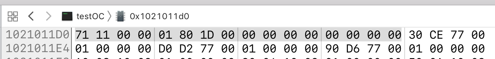
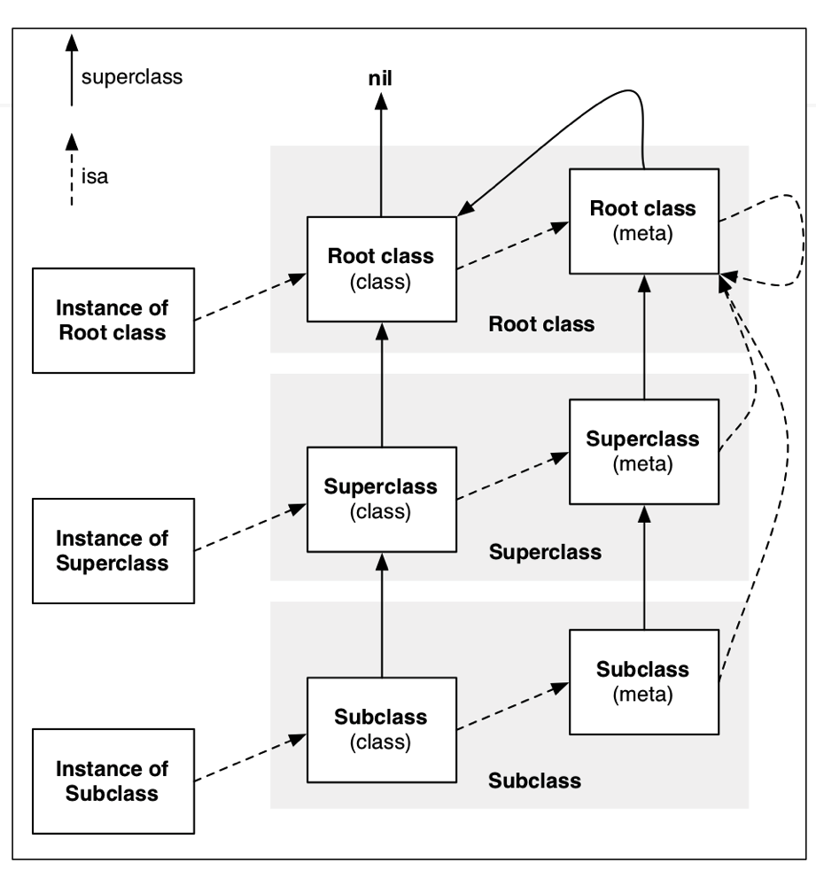

### ### 练习题

1. 一个NSObject对象占用多少内存？

   1. 系统分配了16个字节给NSObject对象(通过**malloc_size**　`#import <malloc/malloc.h>`函数获得)

      可是objc　查看allocWithZone源码　有个关键点**// CF requires all objects be at least 16 bytes.**

      ```
      // Replaced by ObjectAlloc
      + (id)allocWithZone:(struct _NSZone *)zone {
          return _objc_rootAllocWithZone(self, (malloc_zone_t *)zone);
      }
      id _objc_rootAllocWithZone(Class cls, malloc_zone_t *zone)
      {
          id obj;
          // allocWithZone under __OBJC2__ ignores the zone parameter
          (void)zone;
          obj = class_createInstance(cls, 0);
          
          if (slowpath(!obj)) obj = callBadAllocHandler(cls);
          return obj;
      }
      id class_createInstance(Class cls, size_t extraBytes)
      {
          return _class_createInstanceFromZone(cls, extraBytes, nil);
      }
      
      static __attribute__((always_inline)) 
      id _class_createInstanceFromZone(Class cls, size_t extraBytes, void *zone, 
                                    bool cxxConstruct = true, 
                                    size_t *outAllocatedSize = nil)
      {
          if (!cls) return nil;
      
          assert(cls->isRealized());
      
          // Read class's info bits all at once for performance
          bool hasCxxCtor = cls->hasCxxCtor();
          bool hasCxxDtor = cls->hasCxxDtor();
          bool fast = cls->canAllocNonpointer();
      
          size_t size = cls->instanceSize(extraBytes);
          if (outAllocatedSize) *outAllocatedSize = size;
      
          id obj;
          if (!zone  &&  fast) {
              obj = (id)calloc(1, size);
              if (!obj) return nil;
              obj->initInstanceIsa(cls, hasCxxDtor);
          } 
          else {
              if (zone) {
                  obj = (id)malloc_zone_calloc ((malloc_zone_t *)zone, 1, size);
              } else {
                  obj = (id)calloc(1, size);
              }
              if (!obj) return nil;
      
              // Use raw pointer isa on the assumption that they might be 
              // doing something weird with the zone or RR.
              obj->initIsa(cls);
          }
      
          if (cxxConstruct && hasCxxCtor) {
              obj = _objc_constructOrFree(obj, cls);
          }
      
          return obj;
      }
      
      //有个关键点，size最小为16，然后通过obj = (id)calloc(1, size);得到obj
      size_t instanceSize(size_t extraBytes) {
          size_t size = alignedInstanceSize() + extraBytes;
          // CF requires all objects be at least 16 bytes.
          if (size < 16) size = 16;
          return size;
      }
      
      ```

      

   2. 但是NSObject对象内部只使用了8个字节的空间（64bit环境下，可以通过**class_getInstanceSize** `#import <objc/runtime.h>`函数获得）

      返回NSObject实例对象的成员变量所占用的大小

      

      

      ```
      重写oc代码为c++代码
      clang -rewrite-objc main.m -o main.cpp  
      //指定平台及架构
      xcrun -sdk iphoneos clang -arch arm64 -rewrite-objc main.m -o main-arm64.cpp
      // 不同平台支持的代码是不一样
      // Windows、mac、iOS
      // 模拟器(i386)、32bit(armv7)、64bit（arm64）
      
      ```

      ```
      int main(int argc, const char * argv[]) {
          /* @autoreleasepool */ { __AtAutoreleasePool __autoreleasepool; 
      
              NSLog((NSString *)&__NSConstantStringImpl__var_folders_1p_ggtwy57x5v91l5zz1yqbb_pc0000gn_T_main_29c53f_mi_0);
      
              Person *p = ((Person *(*)(id, SEL))(void *)objc_msgSend)((id)((Person *(*)(id, SEL))(void *)objc_msgSend)((id)objc_getClass("Person"), sel_registerName("alloc")), sel_registerName("init"));
          }
          return 0;
      }
      
      //Class　指定　64位8个字节
      typedef struct objc_class *Class;
      struct NSObject_IMPL {
      	Class isa;　//只有一个成员变量
      };
      struct Person_IMPL {
      	struct NSObject_IMPL NSObject_IVARS;
      };
      
      struct objc_class {
          Class _Nonnull isa ;
      };
      
      Person *p = [[Person alloc] init];
      NSLog(@"%zd",class_getInstanceSize([Person class])); // 8
      NSLog(@"%zd",malloc_size((__bridge const void*)p));	 // 16
      ```

   3. 分配了16个字节，但利用的只有8个,前8个字节为isa指针，即成员变量的字节数

      

       

      输入一个NSObject 对象地址　后8位为0

      ```
      <Person: 0x1021011d0>
      (lldb) memory read 0x1021011d0
      0x1021011d0: 71 11 00 00 01 80 1d 00 00 00 00 00 00 00 00 00  q...............
      0x1021011e0: 30 ce 77 00 01 00 00 00 d0 d2 77 00 01 00 00 00  0.w.......w.....
      
      (lldb) memory read/4x 0x1021011d0
      0x1021011d0: 0x00001171 0x001d8001 0x00000000 0x00000000
      可以看出是小端模式　71 11 00 00 01　=> 0x00001171
      ```

      #### 继承成员变量，图

      `typedef struct objc_class *Class;` Class只是`struct objc_class *`类型的指针

   4. NSObject对象所占内存分**成员变量所占**（**考虑成员变量及内存对齐**）及**自身所占**`malloc_size()`(16倍数)

      ```
      #define NANO_MAX_SIZE			256 /* Buckets sized {16, 32, 48, ..., 256} */
      分配内存是有个内存分配对齐
      ```

      

2. 对象的isa指针指向哪里？

   1. instance对象isa指向class对象
   2. class对象isa指向meta-class对象
   3. meta-class对象isa指向基类的meta-class对象
   4. **注意**NSObject的meta-class对象supclas指向NSObject的类对象,NSObject的meta-class对象的isa批向自己

3. oc的类信息存放在哪里？ 

   1. 成员变量具体值，存放在instance对象中
   2. 对象方法、属性、**成员变量todo**、协议信息存放在类对象中
   3. 类方法，存放在meta-class对象中

oc对象

1. 实例对象
2. 类对象  `class`方法返回的一直是class对象,即类对象
   1. **superclass指针**　父类的类对象
3. 元类对象　meta-class
   1. 通过`object_getClass([NSObject class])`
   2. 元类对象存放类方法
   3. `class_isMetaClass`可以判断是否是元类对象
   4. **superclass指针**　父类的元类对象
4. 类对象与元类对象的内存结构一样


```
objc_getClass()
object_getClass()
```


类对象有superclass指针

```
[student init]
isa找到student类对象 superclass superclass
```

#### isa and superclass



类方法　调用对象方法时，如果子类函数该对象方法吗？如果有参数吗？

打印isa，直接打印对象可以不？

object_class源码


## KVO

Key-Value Observing，俗称“键值监听

1. context传值，传哪了？
2. 添加过kvo之后，会修改实例对象的isa指针，类对象会变成NSKVONotifying_Person(通过runtime动态创建的），可以直接查看实例对象的isa
3. NSKVONotifying_Person有自己的元类对象
4. Didchange 会调obser..

setage对应实现变了,_NSSet...

willChangeValueForKey　与didChangeValueForKey配对使用

## KVC

kvc会触发kvo,不管有没有setter方法　willChangeValueForKey　与didChangeValueForKey配对使用
_category_t 从编译角度看


## Category

分类的对象方法存在类对象里面，通过runtime在运行过程中实现，而不是编译时实现


#### 关联对象，dict实现　内存泄露、线程安全问题

关联对象key的注意
1.存自己的地址，如果不赋值，会为null，有问题
2.char
3.字符串
4.@selector(方法名)　_cmd隐式函数　**（最方便）**

也可以对类对象添加属性，可以测试一下

不会影响内存结构？


原理
1.AssociationsManager
2.AssociationsHashMap
3.da
4.

[class:[key:(value,policy)]]

关联对象没有弱引用，不会置nil


#### block

block　结构体，初始化时会传入被捕获的成员变量

全局变量不是auto,可以查下auto

捕获对象是值传递吗？


想一想对象的问题，

如果　用Person *P = self.person; 然后使用p呢？

oc前两个参数是self,及_cmd

如果　let name = self.name ,block捕获name呢？


栈 auto　不持有对象，why?
全局 非auto
堆　copy

block能继承吗？

__weak  转c++

方法里的block，对对象的生命周期的影响

__block 包装对象，如果本身是对象呢？

blokc内在管理，

Weakself->age，block不能编译？

arc　strong与copy没区别都是copy，mrc　strong不会拷贝对象


#### Runtime

位域，先写的在右边　char?而不是bool?

C++析构函数？
位域直接取，看值　


Encode  方法签名与实际不一样，多呢？

super class ，试着重写class方法

my name is ,时看下对象在栈中的调用　，不要super 呢？


### 常用LLDB指令

1. Print、p:打印
   po:打印对象

2. 读取内存　（x是16进制，f是浮点，d是10进制）
   memory read/数量格式字节数  内存地址

   x/数量格式字节数  内存地址　

   x/3xw  0x10010　（b：byte 1字节，h：half word 2字节　w：word 4字节，g：giant word 8字节）

3. 修改内存中的值
   memory  write  内存地址  数值
   memory  write  0x0000010  10

Initialize, msgsend　源码第一次会调


**查看内存信息 Debug -> Debug Workfllow -> View Memory** 


Msgsendsuper2

x/g x/3g 

直接转c++

父类子类，多次category呢？


runtime添加成员变量，内存，已存在的类呢？

setclass之后访问变量？


类簇，真实类型会发生变化


Gnu gnn not unix


RunLoop

可以拿到当前mode

1个runLoop对应一个线程　底层源码证明　

自己写下线程保活代码

1.注意点　好几个　untilDone,runloopstop

用　target selector object,应该用nsinvocation


GCD

sync立马执行

async等当前任务执行完成之后再执行

并发队列允许多个任务一起执行

perform本质


condictoinlock 顺序 通过打印可以看

锁多个对象　来调用

Synchro 能否递归锁

多读单写，实现方式

封装gcdtimer


内在管理，属性的基本数据类型在哪个区？为什么不需要管理内存？

MRC管理，注意点

自定义copy

protocol buffer


swift尝试c++

[苹果源码](https://opensource.apple.com/tarballs/)