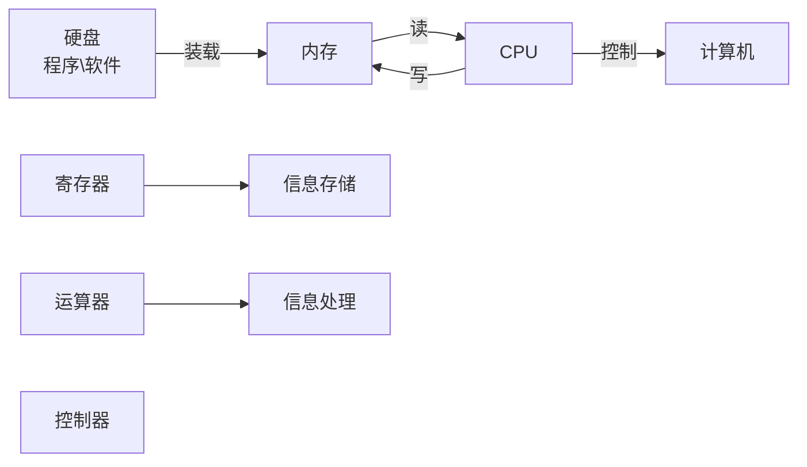

# swift

## 1.程序的本质



<div style="color:#fff;background-color:#375DB7; width:300px; height:80px;text-align:center;>
  <p style="margin-bototm:20px;font-size:20px">
    cpu
  </p>
  <span style="background-color:#5FA037;margin-right:10px;padding:5px">
    寄存器
  </span>
 	<span style="background-color:#5FA037;cyan;margin-right:10px;padding:5px">
    运算器
  </span>
  <span style="background-color:#5FA037;padding:5px">
    控制器 
  </span>
</div>

2. 寄存器与内存

   * 通常，CPU会先将内存中的数据存储到寄存器中，然后再对寄存器中的数据进行运算

   * 假设内存中0xa存的值是3，现在想把它的值加1，并将结果存储到0xb上

     ```
     movq 0xa，%rax  // 先存寄存器
     addq $0xa,%rax // 让寄存器rxa与1相加，把结果放入rax
     movq %rax,$0xb // 将rax的值给内存究竟
     ```

3. 编程语言发展

   ```mermaid
   graph LR
   	高级语言 --编译-->汇编语言
   	汇编语言 --编译-->机器语言 
   	机器语言 --反编译-->汇编语言
   	机器语言 --汇编-->计算机
   ```

   * **汇编语言**与**机器语言**一一对应，每一条机器指令都有与之对应的**汇编指令**
   * **汇编语言**可以通过编译得到**机器语言**，**机器语言**可以通过反汇编得到**汇编语言**
   * **高级语言**可以通过编译得到**汇编语言\机器语言**，但**汇编语言\机器语言**几乎不可能还原成**高级语言**

4. 汇编语言种类

   * 8086汇编(16bit)
   * x86汇编(32bit)
   * x64汇编(64bit)
   * ARM汇编(嵌入式、移动设备)
   * x86、x64汇编根据编译器的不同，有2种书写格式 
     * Intel:Windows派系
     * AT&T :Unix派系

5. 常见汇编指令

   | 项目           | AT&T                                                        | intel                                                 | 说明                                                         |
   | -------------- | ----------------------------------------------------------- | ----------------------------------------------------- | ------------------------------------------------------------ |
   | 寄存器命名     | %rax                                                        | rax                                                   |                                                              |
   | **操作数顺序** | movq %rax,%rdx                                              | mov rdx,rax                                           | **将rax赋值给rdx**                                           |
   | 常数\立即数    | movq &amp;3,%rax<br/> movq  ​&amp;0x10,%rax                  | mov rax,3<br/>mov rax,0x10                            | 将3赋值给rax <br>将0x10赋值给rax                             |
   | 内存赋值       | movq $0xa,0x1ff7(%rip)                                      | move qword ptr  [rip+0x1ff7],0xa                      | 将0xa赋值给地址为rip + 0x1ff7的内存空间                      |
   | 取内存地址     | leaq -0x18(%rbp),%rax                                       | lea rax,[rbp -ox18]                                   | 将rbp – 0x18这个地址值赋值给rax                              |
   | jpm指令        | jmp *%rdx <br/>jmp 0x4001002<br/>jmp *(%rax)<br/>           | jmp rdx <br>jmp 0x4001002 <br>jmp [rax]               | call和jmp写法类似                                            |
   | 操作数长度     | movl %eax, %edx<br> movb $0x10, %al<br> leaw 0x10(%dx), %ax | mov edx, eax<br> mov al, 0x10<br> lea ax, [dx + 0x10] | b = byte (8-bit)<br/>s = short (16-bit integer or 32-bit floating point) w = word (16-bit)<br/>l = long (32-bit integer or 64-bit floating point) q = quad (64 bit)<br/>t = ten bytes (80-bit floating point) |
   |                |                                                             |                                                       |                                                              |
   |                |                                                             |                                                       |                                                              |
   |                |                                                             |                                                       |                                                              |
   |                |                                                             |                                                       |                                                              |
   |                |                                                             |                                                       |                                                              |
   |                |                                                             |                                                       |                                                              |

6. 寄存器

   * 有16个常用寄存器
     * rax、rbx、rcx 、rdx、rsi、rdi、rbp、rsp pr8、r9、r10、r11、r12、r13、r14、r15
   * 寄存器的具体用途
     * rax、rdx常作为函数返回值使用 
     * rdi、rsi、rdx、rcx、r8、r9等寄存器常用于存放函数参数 
     * rsp（stack pointer）、rbp(base pionter)用于栈操作  
     * rip作为指令指针
       * 存储着CPU下一条要执行的指令的地址
       * 一旦CPU读取一条指令，rip会自动指向下一条指令(存储下一条指令的地址)
   * 高低位 
     * todo img

7.  lldb常用指令

   * 读取寄存器的值 
     * register read/格式 
     * register read/x
   * 修改寄存器的值
     * register write 寄存器名称 数值 
     * register write rax 0
   * 读取内存中的值 
     * x/数量-格式-字节大小 内存地址 
     * x/3xw 0x0000010
   * 修改内存中的值
     * memory write 内存地址 数值 
     * memory write 0x0000010 10
   * 格式
     * x是16进制，f是浮点，d是十进制
   * 字节大小
     * b – byte 1字节
     * h – half word 2字节 
     * w – word 4字节
     * g – giant word 8字节
   * expression 表达式 
     * 可以简写:expr 表达式 
     * expression $rax 
     * pexpression $rax = 1
   * po 表达式 
     * print 表达式 
     * po/x $rax 
     * po (int)$rax
   * thread step-over、next、n 
     * 单步运⾏行行，把子函数当做整体⼀一步执⾏行行(源码级别)
   * thead step-in、step、s 
     * 单步运⾏行行，遇到子函数会进⼊入子函数(源码级别)
   * thread step-inst-over、nexti、ni 
     * 单步运⾏行行，把子函数当做整体⼀一步执⾏行行(汇编级别)
   * thread step-inst、stepi、si 
     * 单步运⾏行行，遇到子函数会进⼊入子函数(汇编级别)
   * thread step-out、finish 
     * 直接执⾏行行完当前函数的所有代码，返回到上一个函数(遇到断点会卡住)

规律

* 内存地址格式为:0x4bdc(%rip)，一般是全局变量，全局区(数据段) 
* 内存地址格式为:-0x78(%rbp)，一般是局部变量，栈空间
* 内存地址格式为:0x10(%rax)，一般是堆空间


## Swiftc

* swiftc存放在Xcode内部 
  * Contents/Developer/Toolchains/XcodeDefault.xctoolchain/usr/bin
* 一些操作
  * 生成语法树: `swiftc -dump-ast main.swift `
  * 生成最简洁的SIL代码:`swiftc -emit-sil main.swift `
  * 生成LLVM IR代码: `swiftc -emit-ir main.swift -o main.ll`
  *  生成汇编代码: `swiftc -emit-assembly main.swift -o main.s`
* 对汇编代码进行分析，可以真正掌握编程语言的本质


```

```


swift

#### Playground  

import PlaygroundSupport

MemoryLayout

多重可选项


[swift编译流程](https://swift.org/compiler-stdlib)


[流程图语法](https://mermaidjs.github.io/demos.html)

https://github.com/pro648/tips